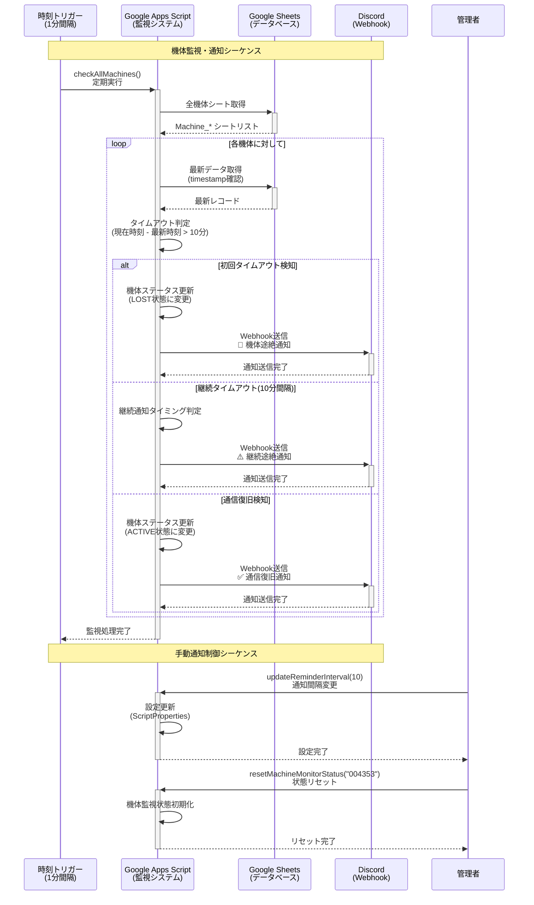

# Google Apps Script (GAS) Telemetry System v2.0.0

リアルタイム機体テレメトリ収集・監視システム - Google Sheets + Discord通知機能付き

## 🚀 クイックスタート

### 前提条件

- Google アカウント
- Google Sheets へのアクセス権限
- Python 3.7+ (テスト用)

### WebApp URL

**現在のデプロイ済みURL:**
```
https://script.google.com/macros/s/AKfycbys_1sl065_wV_0RusA_aIOxtA3HUuqizsItE7q8g6Qq9vyrd836MtfSKtc5oRh0PRCcA/exec
```

**スプレッドシート:**
https://docs.google.com/spreadsheets/d/1SocK5ILBHp-xWsAR6KiKkStret4O1lXqKA0zkAOyIwk/edit?usp=sharing

## 📁 プロジェクト構造

```
GAS/
├── README.md                    # このファイル
├── SpreadSheets_GAS.gs          # 統合デプロイファイル
├── src/                         # ソースコード
│   ├── Main.gs                 # エントリポイント・ルーティング
│   ├── Config.gs               # 設定管理・環境変数
│   ├── DataManager.gs          # データ処理・保存
│   ├── MachineMonitor.gs       # 機体監視・タイムアウト検知
│   ├── WebhookNotification.gs  # Discord通知機能
│   ├── Utils.gs                # 共通ユーティリティ
│   └── SpreadSheets_GAS.gs     # 統合ファイル（src/配下の全コード）
├── examples/                   # サンプルコード・データ
│   ├── python/                 # Python実装例
│   │   ├── simple_sender.py    # 基本的な送信テスト
│   │   ├── simple_getter.py    # 基本的な取得テスト
│   │   ├── register_machine.py # 機体登録
│   │   ├── test_sender.py      # 高機能送信テスト
│   │   └── test_*.py          # 各種テストスクリプト
│   └── json/                   # JSONデータサンプル
│       ├── telemetry_data.json
│       └── register_machine.json
└── docs/                       # ドキュメント
    └── webhook_design.md       # Discord通知システム設計書
```

## 🔄 API フロー図

### データ送信フロー（POST）

```mermaid
sequenceDiagram
    participant Client as クライアント<br/>(Python/IoT機器)
    participant GAS as Google Apps Script<br/>(WebApp)
    participant Sheet as Google Sheets<br/>(データベース)
    participant Discord as Discord<br/>(通知)

    Note over Client, Discord: テレメトリデータ送信シーケンス
    
    Client->>+GAS: POST /exec<br/>JSON データ送信
    Note right of Client: {"DataType": "HK",<br/>"MachineID": "004353",<br/>"GPS": {...}, "BAT": 3.45}
    
    GAS->>GAS: データ検証<br/>(MachineID, GPS等)
    
    alt データ形式が正しい場合
        GAS->>+Sheet: Machine_{ID} シート確認
        alt シートが存在しない場合
            Sheet-->>GAS: シート未存在
            GAS->>+Sheet: 新規シート作成<br/>ヘッダー設定
            Sheet-->>-GAS: シート作成完了
        else シートが存在する場合
            Sheet-->>-GAS: シート存在確認
        end
        
        GAS->>+Sheet: データ行追加<br/>(timestamp, GPS, battery等)
        Sheet-->>-GAS: 保存完了(行番号)
        
        GAS->>GAS: 監視ステータス更新<br/>(lastSeen時刻更新)
        
        GAS-->>-Client: 成功レスポンス<br/>{"status": "success",<br/>"rowNumber": 15}
        
    else データ形式が不正な場合
        GAS-->>-Client: エラーレスポンス<br/>{"status": "error",<br/>"message": "Invalid format"}
    end

    Note over Client, Discord: 機体登録シーケンス
    
    Client->>+GAS: POST /exec<br/>機体登録リクエスト
    Note right of Client: {"action": "registerMachine",<br/>"MachineID": "004353"}
    
    GAS->>+Sheet: Machine_{ID} シート作成
    Sheet-->>-GAS: シート作成完了
    
    GAS->>GAS: 監視対象として登録<br/>(Active: true)
    
    GAS-->>-Client: 登録完了レスポンス<br/>{"status": "success"}
```

### データ受信フロー（GET）

```mermaid
sequenceDiagram
    participant Frontend as フロントエンド<br/>(React App)
    participant GAS as Google Apps Script<br/>(WebApp)
    participant Sheet as Google Sheets<br/>(データベース)

    Note over Frontend, Sheet: 全機体データ取得シーケンス
    
    Frontend->>+GAS: GET /exec?action=getAllMachines
    
    GAS->>+Sheet: 全シート一覧取得
    Sheet-->>-GAS: Machine_* シートリスト
    
    loop 各機体シートに対して
        GAS->>+Sheet: Machine_{ID} データ読み取り
        Sheet-->>-GAS: 機体データ(全行)
        GAS->>GAS: データ変換<br/>(LAT→latitude,<br/>LNG→longitude等)
    end
    
    GAS->>GAS: レスポンス形式整形<br/>(machines配列作成)
    
    GAS-->>-Frontend: 統合データレスポンス<br/>{"status": "success",<br/>"machines": [...]}

    Note over Frontend, Sheet: 特定機体データ取得シーケンス
    
    Frontend->>+GAS: GET /exec?action=getMachine<br/>&machineId=004353
    
    GAS->>GAS: MachineID検証
    
    alt 有効なMachineIDの場合
        GAS->>+Sheet: Machine_004353 データ読み取り
        Sheet-->>-GAS: 機体データ(全行)
        
        GAS->>GAS: データ変換・整形
        
        GAS-->>-Frontend: 機体データレスポンス<br/>{"status": "success",<br/>"machines": [single_machine]}
        
    else 無効なMachineIDの場合
        GAS-->>-Frontend: エラーレスポンス<br/>{"status": "error",<br/>"message": "Machine not found"}
    end

    Note over Frontend, Sheet: 機体リスト取得シーケンス
    
    Frontend->>+GAS: GET /exec?action=getMachineList
    
    GAS->>+Sheet: 全シート一覧取得
    Sheet-->>-GAS: Machine_* シートリスト
    
    GAS->>GAS: 機体ID抽出<br/>(シート名から)
    
    loop 各機体に対して
        GAS->>+Sheet: 最新データ1行取得
        Sheet-->>-GAS: 最新レコード
        GAS->>GAS: 基本情報抽出<br/>(lastUpdate, dataCount)
    end
    
    GAS-->>-Frontend: 機体リスト<br/>{"machineIds": [...],<br/>"lastUpdates": {...}}
```

### Discord通知フロー



## 📤 データ送信 API (POST)

### エンドポイント仕様

- **URL:** WebApp URL
- **Method:** POST
- **Content-Type:** application/json

### テレメトリデータ送信

```json
{
  "DataType": "HK",
  "MachineID": "004353",
  "MachineTime": "2025/07/16 01:38:59",
  "GPS": {
    "LAT": 34.124125,
    "LNG": 153.131241,
    "ALT": 342.5,
    "SAT": 43
  },
  "BAT": 3.45,
  "CMT": "MODE:NORMAL,COMM:OK,GPS:LOCKED"
}
```

### 機体登録

```json
{
  "action": "registerMachine",
  "MachineID": "004353"
}
```

### レスポンス例

**成功時:**
```json
{
  "status": "success",
  "message": "Data saved successfully",
  "rowNumber": 15,
  "sheetName": "Machine_004353",
  "timestamp": "2025-07-24T11:30:00.000Z"
}
```

**エラー時:**
```json
{
  "status": "error",
  "message": "Invalid MachineID format",
  "timestamp": "2025-07-24T11:30:00.000Z"
}
```

## 📥 データ取得 API (GET)

### 全機体データ取得
```
?action=getAllMachines
```

### 特定機体データ取得
```
?action=getMachine&machineId=004353
```

### 機体リスト取得
```
?action=getMachineList
```

### レスポンス例

```json
{
  "status": "success",
  "timestamp": "2025-07-24T11:30:00.000Z",
  "machines": [
    {
      "machineId": "004353",
      "lastUpdate": "2025-07-24T11:29:45.000Z",
      "dataCount": 147,
      "data": [
        {
          "timestamp": "2025-07-24T11:29:45.000Z",
          "machineTime": "2025/07/24 11:29:45",
          "machineId": "004353",
          "dataType": "HK",
          "latitude": 34.124125,
          "longitude": 153.131241,
          "altitude": 342.5,
          "satellites": 43,
          "battery": 3.45,
          "comment": "MODE:NORMAL,COMM:OK,GPS:LOCKED"
        }
      ]
    }
  ],
  "totalMachines": 1
}
```

## 🔔 Discord通知システム

### 機能概要

システムは自動的に機体の通信状態を監視し、異常を検知した際にDiscordに通知を送信します。

### 通知タイプ

1. **信号途絶通知** - 機体からの通信が途絶えた際の初回通知
2. **継続通知** - 通信途絶が継続している場合の定期通知（10分間隔）
3. **復旧通知** - 通信が復旧した際の通知

### 設定方法

1. **Discord Webhook URL設定:**
   ```javascript
   // GASエディタで実行
   setScriptProperty('DISCORD_WEBHOOK_URL', 'your_webhook_url_here');
   ```

2. **通知間隔設定:**
   ```javascript
   // 継続通知間隔を10分に設定
   updateReminderInterval(10);
   ```

3. **監視システム初期化:**
   ```javascript
   // 初回セットアップ実行
   initialSetup();
   ```

### 通知設定パラメータ

| パラメータ | デフォルト値 | 説明 |
|-----------|-------------|------|
| TIMEOUT_MINUTES | 10分 | 通信途絶判定時間 |
| REMINDER_INTERVAL_MINUTES | 10分 | 継続通知間隔 |
| CHECK_INTERVAL_MINUTES | 1分 | 監視チェック間隔 |
| ENABLE_NOTIFICATIONS | true | 通知機能ON/OFF |

## 💻 Python サンプル使用方法

### 環境準備

```bash
cd examples/python
pip install requests
```

### 基本テスト

```bash
# 最速送信テスト
python simple_sender.py

# 最速取得テスト  
python simple_getter.py

# 機体登録
python register_machine.py

# 高機能送信テスト
python test_sender.py
```

### テストスクリプト

```bash
# API互換性テスト
python test_api_compatibility.py

# 通知システムテスト
python test_notification_system.py

# リアルな使用シナリオテスト
python test_realistic_scenario.py

# タイムアウト動作テスト
python test_timeout_simulation.py
```

## 🗄️ データベース構造

### スプレッドシート構造

各機体ごとに `Machine_{機体ID}` シートが作成されます：

| GAS Time | MachineTime | MachineID | DataType | Latitude | Longitude | Altitude | GPS Satellites | Battery | Comment | Active |
|----------|-------------|-----------|----------|----------|-----------|----------|----------------|---------|---------|--------|
| システム受信時刻 | 機体時刻 | 機体ID | データタイプ | 緯度 | 経度 | 高度 | 衛星数 | バッテリー | コメント | 監視ON/OFF |

### データ変換

**POST時の入力形式:**
```json
{"GPS": {"LAT": 34.124, "LNG": 153.131, "ALT": 342.5, "SAT": 43}}
```

**GET時の出力形式:**
```json
{"latitude": 34.124, "longitude": 153.131, "altitude": 342.5, "satellites": 43}
```

## 🔧 システム管理

### 監視システム制御

```javascript
// 監視統計取得
getMachineMonitoringStats()

// 特定機体の強制チェック
checkSpecificMachine("004353")

// 監視ステータスリセット
resetMachineMonitorStatus("004353")

// 設定状況確認
getConfigStatus()
```

### トリガー管理

```javascript
// 監視トリガー設定
setupTriggers()

// 全トリガー削除
deleteTriggers()
```

## 🐛 トラブルシューティング

### よくあるエラー

| HTTPステータス | 原因 | 解決方法 |
|----------------|------|----------|
| 403 Forbidden | WebApp公開設定 | Apps Scriptで「全員」に公開設定 |
| 404 Not Found | URL間違い | WebApp URLを再確認 |
| 500 Internal Server Error | JSONフォーマットエラー | リクエスト形式を確認 |

### デバッグ方法

1. **GASログ確認:**
   - Apps Script エディタ → 実行 → ログを確認

2. **通知システム状態確認:**
   ```javascript
   getMachineMonitoringStats()
   ```

3. **設定確認:**
   ```javascript
   getConfigStatus()
   ```

## 🔄 バージョン履歴

### v2.0.0 (Current)
- Discord通知システム追加
- 機体監視・タイムアウト検知機能
- モジュラー構造に再設計
- 設定管理システム強化
- テストスイート拡充

### v1.0.0
- 基本的なテレメトリ送受信機能
- Google Sheets連携
- 機体別データ管理

## 📞 サポート

- **技術的な問題:** GASエディタのログを確認
- **Discord通知:** webhook設定とスクリプトプロパティを確認
- **データ形式:** example_json/ ディレクトリのサンプルを参照

---

**開発者向け:** `src/` ディレクトリの各ファイルを確認して詳細な実装を理解してください。