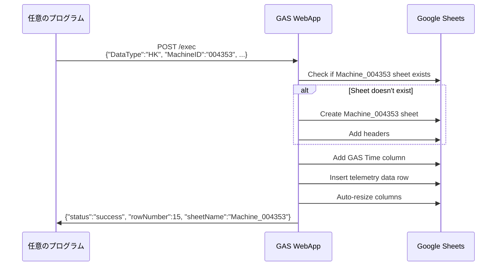
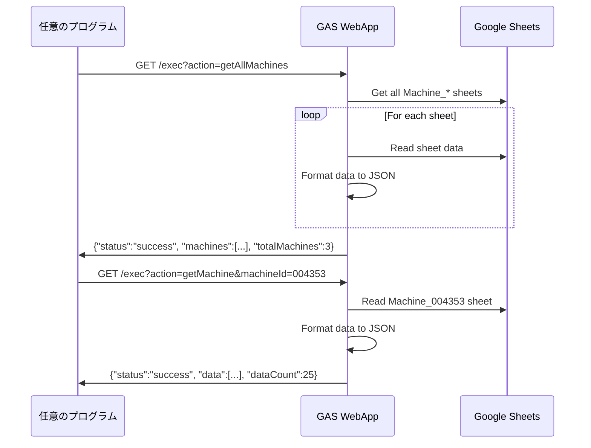
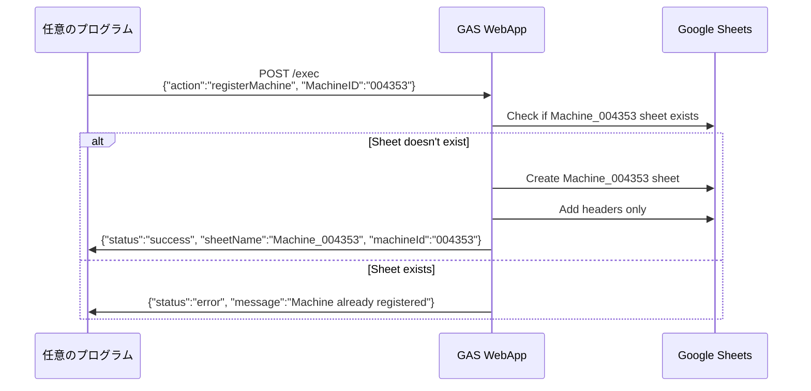

# Google Apps Script (GAS) Telemetry System

Google Apps Script を使用したテレメトリデータの送信・取得システム

## 🚀 クイックスタート

### 提供される WebApp URL

GAS WebApp は既に設定済みです。以下の URL を使用してください：

```
https://script.google.com/macros/s/AKfycbys_1sl065_wV_0RusA_aIOxtA3HUuqizsItE7q8g6Qq9vyrd836MtfSKtc5oRh0PRCcA/exec
```

### Python サンプルの準備

```bash
pip install requests
```

## 📤 データ送信（POST）

### API 仕様

**エンドポイント:** `https://script.google.com/macros/s/AKfycbys_1sl065_wV_0RusA_aIOxtA3HUuqizsItE7q8g6Qq9vyrd836MtfSKtc5oRh0PRCcA/exec`  
**メソッド:** POST  
**Content-Type:** application/json

#### テレメトリデータ送信

```json
{
  "DataType": "HK",
  "MachineID": "004353",
  "MachineTime": "2025/07/16 01:38:59",
  "GPS": {
    "LAT": 34.124125,
    "LNG": 153.131241,
    "ALT": 342.5,
    "SAT": 43
  },
  "BAT": 3.45,
  "CMT": "MODE:NORMAL,COMM:OK,GPS:LOCKED,SENSOR:TEMP_OK,PRESSURE:STABLE,ERROR:NONE"
}
```

#### 機体登録

```json
{
  "action": "registerMachine",
  "MachineID": "004353"
}
```

### Python サンプルプログラム

#### 1. `simple_sender.py` - 最速テスト送信

```bash
python simple_sender.py
```

**機能:**

- 固定値でテレメトリデータを即座に送信
- URL と machine_id はコード内で設定
- エラーハンドリングなし、レスポンスを生表示

**用途:** 動作確認、デバッグ、シンプルな送信テスト

#### 2. `register_machine.py` - 機体登録

```bash
python register_machine.py
```

**機能:**

- 機体 ID を入力して新しい機体を登録
- スプレッドシートに `Machine_{機体ID}` シートを作成
- 単一・複数機体の一括登録対応

**用途:** 新しい機体の初期設定

#### 3. `test_sender.py` - 高機能送信テスト

```bash
python test_sender.py
```

**機能:**

- 対話型メニューで詳細設定
- 複数機体への送信
- 連続送信テスト（回数・間隔設定）
- 完全なエラーハンドリング

**用途:** 本格的なテスト、負荷試験、複数機体管理

## 📥 データ取得（GET）

### API 仕様

**エンドポイント:** `https://script.google.com/macros/s/AKfycbys_1sl065_wV_0RusA_aIOxtA3HUuqizsItE7q8g6Qq9vyrd836MtfSKtc5oRh0PRCcA/exec`  
**メソッド:** GET

#### 全機体データ取得

```
?action=getAllMachines
```

#### 特定機体データ取得

```
?action=getMachine&machineId=004353
```

#### 機体リスト取得

```
?action=getMachineList
```

### Python サンプルプログラム

#### 1. `simple_getter.py` - 最速データ取得

```bash
python simple_getter.py
```

**機能:**

- 全機体データ・特定機体データ・機体リストを自動取得
- URL はコード内で設定
- 最新 5 件のデータを表示

**用途:** データ確認、監視、デバッグ

### cURL での直接アクセス例

```bash
# 全機体データ
curl "https://script.google.com/macros/s/AKfycbys_1sl065_wV_0RusA_aIOxtA3HUuqizsItE7q8g6Qq9vyrd836MtfSKtc5oRh0PRCcA/exec?action=getAllMachines"

# 特定機体データ
curl "https://script.google.com/macros/s/AKfycbys_1sl065_wV_0RusA_aIOxtA3HUuqizsItE7q8g6Qq9vyrd836MtfSKtc5oRh0PRCcA/exec?action=getMachine&machineId=004353"

# 機体リスト
curl "https://script.google.com/macros/s/AKfycbys_1sl065_wV_0RusA_aIOxtA3HUuqizsItE7q8g6Qq9vyrd836MtfSKtc5oRh0PRCcA/exec?action=getMachineList"
```

## 🔧 システム仕様

### データフロー

#### テレメトリデータ送信フロー



#### データ取得フロー



#### 機体登録フロー



### スプレッドシートの構造

各機体ごとに `Machine_{機体ID}` のシートが作成されます：

| GAS Time           | MachineTime         | MachineID | DataType | Latitude  | Longitude  | Altitude | GPS Satellites | Battery | Comment        |
| ------------------ | ------------------- | --------- | -------- | --------- | ---------- | -------- | -------------- | ------- | -------------- |
| 2025/07/16 1:38:59 | 2025/07/16 01:38:59 | 004353    | HK       | 34.124125 | 153.131241 | 342.5    | 43             | 3.45    | MODE:NORMAL... |

### レスポンス形式

#### 送信成功時

```json
{
  "status": "success",
  "message": "Data saved successfully",
  "rowNumber": 15,
  "sheetName": "Machine_004353"
}
```

#### 取得成功時

```json
{
  "status": "success",
  "machines": [
    {
      "machineId": "004353",
      "data": [
        {
          "timestamp": "2025-07-16T01:38:59.000Z",
          "machineTime": "2025/07/16 01:38:59",
          "machineId": "004353",
          "dataType": "HK",
          "latitude": 34.124125,
          "longitude": 153.131241,
          "altitude": 342.5,
          "satellites": 43,
          "battery": 3.45,
          "comment": "MODE:NORMAL,COMM:OK,GPS:LOCKED,SENSOR:TEMP_OK,PRESSURE:STABLE,ERROR:NONE"
        }
      ]
    }
  ],
  "totalMachines": 1
}
```

## 📂 サンプルファイル

```
GAS/
├── SpreadSheets_GAS.gs     # GAS メインファイル（参考）
├── simple_sender.py        # 📤 最速送信サンプル
├── simple_getter.py        # 📥 最速取得サンプル
├── test_sender.py          # 📤 高機能送信サンプル
├── register_machine.py     # 🆔 機体登録サンプル
├── example_json/           # JSONサンプル
└── README.md              # このファイル
```

## 🐛 トラブルシューティング

### よくあるエラー

| HTTP ステータス           | 原因                 | 解決方法                |
| ------------------------- | -------------------- | ----------------------- |
| 403 Forbidden             | WebApp 公開設定      | 管理者に連絡            |
| 404 Not Found             | URL 間違い           | URL を確認              |
| 500 Internal Server Error | リクエスト形式エラー | JSON フォーマットを確認 |

### 正常な動作確認

```bash
# 最速確認
python simple_sender.py  # 送信テスト
python simple_getter.py  # 取得テスト
```

## 📋 他言語での実装例

### JavaScript (Node.js)

```javascript
// 送信例
const response = await fetch(
  "https://script.google.com/macros/s/YOUR_SCRIPT_ID/exec",
  {
    method: "POST",
    headers: { "Content-Type": "application/json" },
    body: JSON.stringify({
      DataType: "HK",
      MachineID: "004353",
      MachineTime: "2025/07/16 01:38:59",
      GPS: { LAT: 34.124125, LNG: 153.131241, ALT: 342.5, SAT: 43 },
      BAT: 3.45,
      CMT: "MODE:NORMAL,COMM:OK,GPS:LOCKED,SENSOR:TEMP_OK,PRESSURE:STABLE,ERROR:NONE",
    }),
  }
);

// 取得例
const data = await fetch(
  "https://script.google.com/macros/s/YOUR_SCRIPT_ID/exec?action=getAllMachines"
);
```

### cURL

```bash
# 送信
curl -X POST \
  -H "Content-Type: application/json" \
  -d '{"DataType":"HK","MachineID":"004353","MachineTime":"2025/07/16 01:38:59","GPS":{"LAT":34.124125,"LNG":153.131241,"ALT":342.5,"SAT":43},"BAT":3.45,"CMT":"MODE:NORMAL,COMM:OK,GPS:LOCKED,SENSOR:TEMP_OK,PRESSURE:STABLE,ERROR:NONE"}' \
  https://script.google.com/macros/s/YOUR_SCRIPT_ID/exec
```
