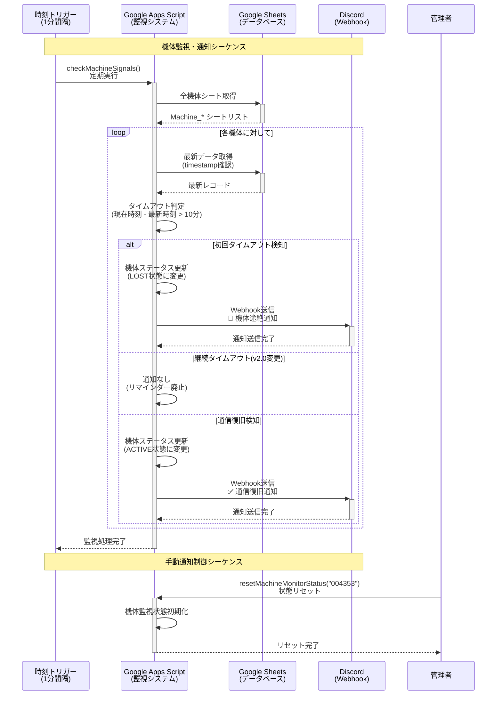
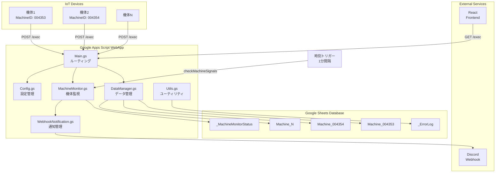
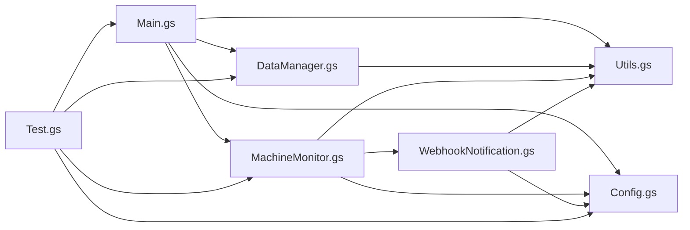
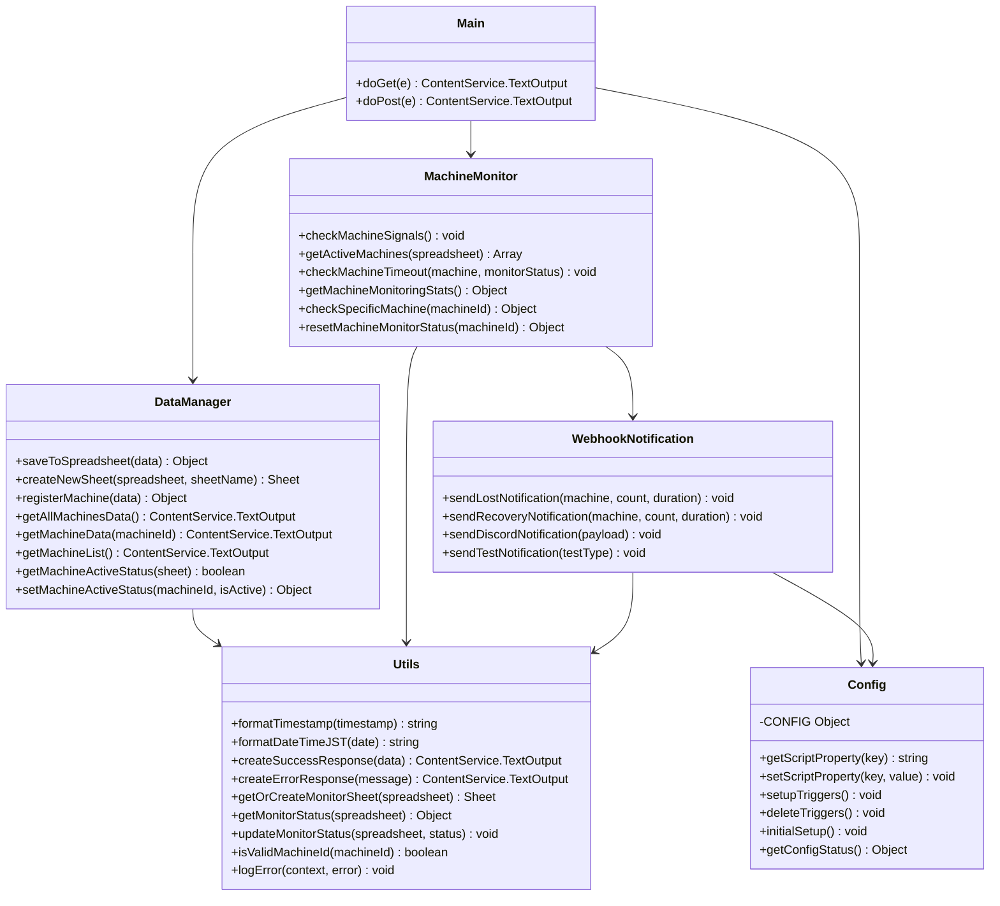
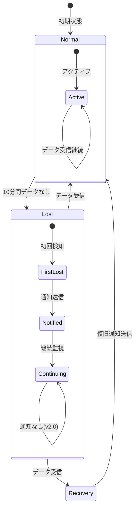
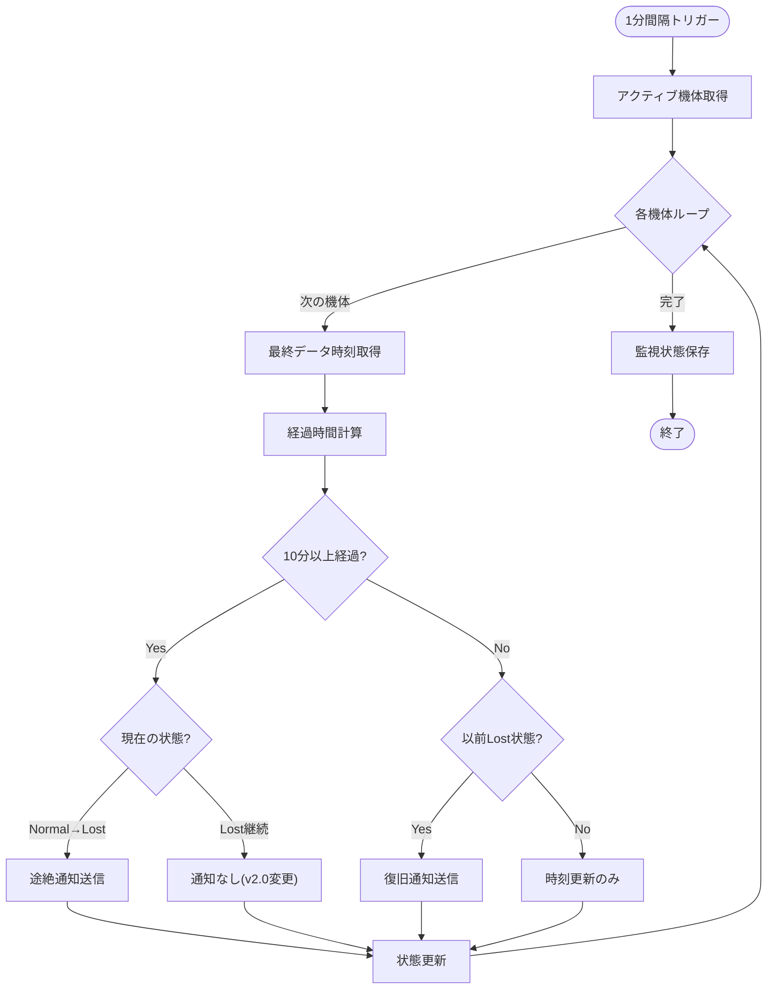
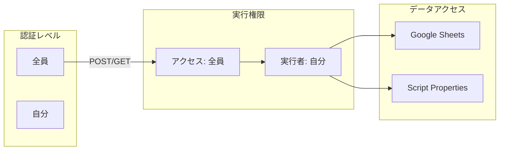
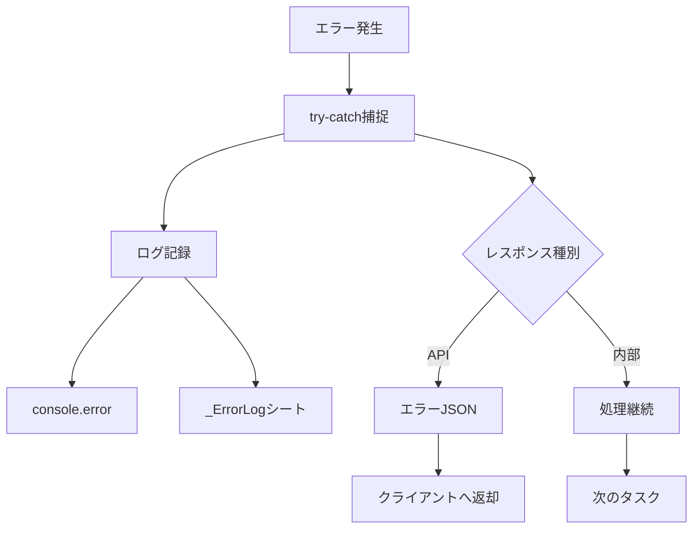

# Google Apps Script (GAS) Telemetry System v2.0.0

リアルタイム機体テレメトリ収集・監視システム - Google Sheets + Discord 通知機能付き

## 📖 目次

### 基本情報

1. [🚀 クイックスタート](#-クイックスタート)
2. [📁 プロジェクト構造](#-プロジェクト構造)
3. [🔄 API フロー図](#-api-フロー図)
4. [📤 データ送信 API (POST)](#-データ送信-api-post)
5. [📥 データ取得 API (GET)](#-データ取得-api-get)
6. [🔔 Discord 通知システム](#-discord通知システム)
7. [💻 Python サンプル使用方法](#-python-サンプル使用方法)

### 技術者向け詳細

8. [🏗️ システムアーキテクチャ](#️-システムアーキテクチャ)
9. [⚙️ モジュール構成](#️-モジュール構成)
10. [🗄️ データベース設計](#️-データベース設計)
11. [👁️ 監視システム](#️-監視システム)
12. [🔐 セキュリティ](#-セキュリティ)
13. [⚡ パフォーマンス最適化](#-パフォーマンス最適化)
14. [🛠️ デバッグ・テスト](#️-デバッグテスト)
15. [🔄 デプロイメント](#-デプロイメント)

---

## 🚀 クイックスタート

### 前提条件

- Google アカウント
- Google Sheets へのアクセス権限
- Python 3.7+ (テスト用)

### WebApp URL

**現在のデプロイ済み URL:**

```
https://script.google.com/macros/s/AKfycbys_1sl065_wV_0RusA_aIOxtA3HUuqizsItE7q8g6Qq9vyrd836MtfSKtc5oRh0PRCcA/exec
```

**スプレッドシート:**
https://docs.google.com/spreadsheets/d/1SocK5ILBHp-xWsAR6KiKkStret4O1lXqKA0zkAOyIwk/edit?usp=sharing

## 📁 プロジェクト構造

```
GAS/
├── README.md                    # このファイル
├── SETUP_INSTRUCTIONS_v2.md     # セットアップガイド
├── src/                         # ソースコード
│   ├── Main.gs                 # エントリポイント・ルーティング
│   ├── Config.gs               # 設定管理・環境変数
│   ├── DataManager.gs          # データ処理・保存
│   ├── MachineMonitor.gs       # 機体監視・タイムアウト検知
│   ├── WebhookNotification.gs  # Discord通知機能
│   ├── Utils.gs                # 共通ユーティリティ
│   └── Test.gs                 # テスト関数群
├── old/                        # 過去のファイル
│   ├── IntegratedSystem_v2.gs  # 統合システム（旧版）
│   └── SpreadSheets_GAS.gs     # 統合デプロイファイル（旧版）
├── examples/                   # サンプルコード・データ
│   ├── python/                 # Python実装例
│   │   ├── simple_sender.py    # 基本的な送信テスト
│   │   ├── simple_getter.py    # 基本的な取得テスト
│   │   ├── register_machine.py # 機体登録
│   │   ├── test_sender.py      # 高機能送信テスト
│   │   └── test_*.py          # 各種テストスクリプト
│   └── json/                   # JSONデータサンプル
│       ├── telemetry_data.json
│       └── register_machine.json
├── docs/                       # ドキュメント
│   └── webhook_design.md       # Discord通知システム設計書
└── tests/                      # テスト設定
    ├── README.md
    └── requirements.txt
```

## 🔄 API フロー図

### データ送信フロー（POST）

```mermaid
sequenceDiagram
    participant Client as クライアント<br/>(Python/IoT機器)
    participant GAS as Google Apps Script<br/>(WebApp)
    participant Sheet as Google Sheets<br/>(データベース)
    participant Discord as Discord<br/>(通知)

    Note over Client, Discord: テレメトリデータ送信シーケンス

    Client->>+GAS: POST /exec<br/>JSON データ送信
    Note right of Client: {"DataType": "HK",<br/>"MachineID": "004353",<br/>"GPS": {...}, "BAT": 3.45}

    GAS->>GAS: データ検証<br/>(MachineID, GPS等)

    alt データ形式が正しい場合
        GAS->>+Sheet: Machine_{ID} シート確認
        alt シートが存在しない場合
            Sheet-->>GAS: シート未存在
            GAS->>+Sheet: 新規シート作成<br/>ヘッダー設定
            Sheet-->>-GAS: シート作成完了
        else シートが存在する場合
            Sheet-->>-GAS: シート存在確認
        end

        GAS->>+Sheet: データ行追加<br/>(timestamp, GPS, battery等)
        Sheet-->>-GAS: 保存完了(行番号)

        GAS->>GAS: 監視ステータス更新<br/>(lastSeen時刻更新)

        GAS-->>-Client: 成功レスポンス<br/>{"status": "success",<br/>"rowNumber": 15}

    else データ形式が不正な場合
        GAS-->>-Client: エラーレスポンス<br/>{"status": "error",<br/>"message": "Invalid format"}
    end

    Note over Client, Discord: 機体登録シーケンス

    Client->>+GAS: POST /exec<br/>機体登録リクエスト
    Note right of Client: {"action": "registerMachine",<br/>"MachineID": "004353"}

    GAS->>+Sheet: Machine_{ID} シート作成
    Sheet-->>-GAS: シート作成完了

    GAS->>GAS: 監視対象として登録<br/>(Active: true)

    GAS-->>-Client: 登録完了レスポンス<br/>{"status": "success"}
```

### データ受信フロー（GET）

```mermaid
sequenceDiagram
    participant Frontend as フロントエンド<br/>(React App)
    participant GAS as Google Apps Script<br/>(WebApp)
    participant Sheet as Google Sheets<br/>(データベース)

    Note over Frontend, Sheet: 全機体データ取得シーケンス

    Frontend->>+GAS: GET /exec?action=getAllMachines

    GAS->>+Sheet: 全シート一覧取得
    Sheet-->>-GAS: Machine_* シートリスト

    loop 各機体シートに対して
        GAS->>+Sheet: Machine_{ID} データ読み取り
        Sheet-->>-GAS: 機体データ(全行)
        GAS->>GAS: データ変換<br/>(LAT→latitude,<br/>LNG→longitude等)
    end

    GAS->>GAS: レスポンス形式整形<br/>(machines配列作成)

    GAS-->>-Frontend: 統合データレスポンス<br/>{"status": "success",<br/>"machines": [...]}

    Note over Frontend, Sheet: 特定機体データ取得シーケンス

    Frontend->>+GAS: GET /exec?action=getMachine<br/>&machineId=004353

    GAS->>GAS: MachineID検証

    alt 有効なMachineIDの場合
        GAS->>+Sheet: Machine_004353 データ読み取り
        Sheet-->>-GAS: 機体データ(全行)

        GAS->>GAS: データ変換・整形

        GAS-->>-Frontend: 機体データレスポンス<br/>{"status": "success",<br/>"machines": [single_machine]}

    else 無効なMachineIDの場合
        GAS-->>-Frontend: エラーレスポンス<br/>{"status": "error",<br/>"message": "Machine not found"}
    end

    Note over Frontend, Sheet: 機体リスト取得シーケンス

    Frontend->>+GAS: GET /exec?action=getMachineList

    GAS->>+Sheet: 全シート一覧取得
    Sheet-->>-GAS: Machine_* シートリスト

    GAS->>GAS: 機体ID抽出<br/>(シート名から)

    loop 各機体に対して
        GAS->>+Sheet: 最新データ1行取得
        Sheet-->>-GAS: 最新レコード
        GAS->>GAS: 基本情報抽出<br/>(lastUpdate, dataCount)
    end

    GAS-->>-Frontend: 機体リスト<br/>{"machineIds": [...],<br/>"lastUpdates": {...}}
```

### Discord 通知フロー



## 📤 データ送信 API (POST)

### エンドポイント仕様

- **URL:** WebApp URL
- **Method:** POST
- **Content-Type:** application/json

### テレメトリデータ送信

```json
{
  "DataType": "HK",
  "MachineID": "004353",
  "MachineTime": "2025/07/16 01:38:59",
  "GPS": {
    "LAT": 34.124125,
    "LNG": 153.131241,
    "ALT": 342.5,
    "SAT": 43
  },
  "BAT": 3.45,
  "CMT": "MODE:NORMAL,COMM:OK,GPS:LOCKED"
}
```

### 機体登録

```json
{
  "action": "registerMachine",
  "MachineID": "004353",
  "metadata": {
    "type": "drone",
    "model": "X-100"
  }
}
```

### アクティブ状態変更

```json
{
  "action": "setActiveStatus",
  "machineId": "004353",
  "isActive": true
}
```

### レスポンス例

**成功時:**

```json
{
  "status": "success",
  "message": "Data saved successfully",
  "rowNumber": 15,
  "sheetName": "Machine_004353",
  "timestamp": "2025-07-24T11:30:00.000Z"
}
```

**エラー時:**

```json
{
  "status": "error",
  "message": "Invalid MachineID format",
  "timestamp": "2025-07-24T11:30:00.000Z"
}
```

## 📥 データ取得 API (GET)

### 全機体データ取得

```
GET /exec?action=getAllMachines
```

### 特定機体データ取得

```
GET /exec?action=getMachine&machineId=004353
```

### 機体リスト取得

```
GET /exec?action=getMachineList
```

### 監視統計取得

```
GET /exec?action=getMonitoringStats
```

### レスポンス例

```json
{
  "status": "success",
  "timestamp": "2025-07-24T11:30:00.000Z",
  "machines": [
    {
      "machineId": "004353",
      "lastUpdate": "2025-07-24T11:29:45.000Z",
      "dataCount": 147,
      "isActive": true,
      "data": [
        {
          "timestamp": "2025-07-24T11:29:45.000Z",
          "machineTime": "2025/07/24 11:29:45",
          "machineId": "004353",
          "dataType": "HK",
          "latitude": 34.124125,
          "longitude": 153.131241,
          "altitude": 342.5,
          "satellites": 43,
          "battery": 3.45,
          "comment": "MODE:NORMAL,COMM:OK,GPS:LOCKED"
        }
      ]
    }
  ],
  "totalMachines": 1
}
```

## 🔔 Discord 通知システム

### 機能概要

システムは自動的に機体の通信状態を監視し、異常を検知した際に Discord に通知を送信します。

### v2.0 の変更点

- **リマインダー通知廃止**: 通信途絶時と復旧時の 2 回のみ通知
- **通知回数削減**: 監視負荷を軽減

### 通知タイプ

1. **信号途絶通知** - 機体からの通信が途絶えた際の初回通知
2. **復旧通知** - 通信が復旧した際の通知

### 設定方法

1. **Discord Webhook URL 設定:**

   ```javascript
   // GASエディタで実行
   setScriptProperty("DISCORD_WEBHOOK_URL", "your_webhook_url_here");
   ```

2. **監視システム初期化:**
   ```javascript
   // 初回セットアップ実行
   initialSetup();
   ```

### 通知設定パラメータ

| パラメータ             | デフォルト値 | 説明             |
| ---------------------- | ------------ | ---------------- |
| TIMEOUT_MINUTES        | 10 分        | 通信途絶判定時間 |
| CHECK_INTERVAL_MINUTES | 1 分         | 監視チェック間隔 |
| ENABLE_NOTIFICATIONS   | true         | 通知機能 ON/OFF  |

## 💻 Python サンプル使用方法

### 環境準備

```bash
cd examples/python
pip install requests
```

### 基本テスト

```bash
# 最速送信テスト
python simple_sender.py

# 最速取得テスト
python simple_getter.py

# 機体登録
python register_machine.py

# 高機能送信テスト
python test_sender.py
```

### テストスクリプト

```bash
# API互換性テスト
python test_api_compatibility.py

# 通知システムテスト
python test_notification_system.py

# リアルな使用シナリオテスト
python test_realistic_scenario.py

# タイムアウト動作テスト
python test_timeout_simulation.py
```

---

# 技術者向け詳細仕様

## 🏗️ システムアーキテクチャ

### 全体構成図



### モジュール依存関係



## ⚙️ モジュール構成

### ファイル構造と責務

| ファイル                   | 責務                           | 主要関数                                                          |
| -------------------------- | ------------------------------ | ----------------------------------------------------------------- |
| **Main.gs**                | エントリポイント・ルーティング | `doGet()`, `doPost()`                                             |
| **DataManager.gs**         | データ永続化・取得             | `saveToSpreadsheet()`, `getAllMachinesData()`, `getMachineData()` |
| **MachineMonitor.gs**      | 機体監視・タイムアウト検知     | `checkMachineSignals()`, `checkMachineTimeout()`                  |
| **WebhookNotification.gs** | Discord 通知                   | `sendLostNotification()`, `sendRecoveryNotification()`            |
| **Config.gs**              | 設定管理・初期化               | `initialSetup()`, `setupTriggers()`                               |
| **Utils.gs**               | 共通ユーティリティ             | `formatTimestamp()`, `createSuccessResponse()`, `logError()`      |
| **Test.gs**                | テスト関数群                   | `runAllTests()`, `testDiscordNotifications()`                     |

### 主要クラス図（概念的）



## 🗄️ データベース設計

### シート構造

#### 1. Machine\_{ID} シート

| 列  | ヘッダー       | 型       | 説明                         |
| --- | -------------- | -------- | ---------------------------- |
| A   | GAS Time       | DateTime | システム受信時刻 (JST)       |
| B   | MachineTime    | String   | 機体時刻                     |
| C   | MachineID      | String   | 機体識別子                   |
| D   | DataType       | String   | データタイプ                 |
| E   | Latitude       | Number   | 緯度                         |
| F   | Longitude      | Number   | 経度                         |
| G   | Altitude       | Number   | 高度 (m)                     |
| H   | GPS Satellites | Number   | GPS 衛星数                   |
| I   | Battery        | Number   | バッテリー電圧 (V)           |
| J   | Comment        | String   | コメント                     |
| K   | IsActive       | Boolean  | アクティブ状態 (K1 セルのみ) |

#### 2. \_MachineMonitorStatus シート

| 列  | ヘッダー           | 型       | 説明                   |
| --- | ------------------ | -------- | ---------------------- |
| A   | MachineID          | String   | 機体識別子             |
| B   | LastNotified       | DateTime | 最終通知時刻           |
| C   | NotificationStatus | String   | 通知状態 (normal/lost) |
| D   | LastDataReceived   | DateTime | 最終データ受信時刻     |
| E   | NotificationCount  | Number   | 通知回数               |
| F   | FirstLostTime      | DateTime | 初回途絶時刻           |

#### 3. \_ErrorLog シート

| 列  | ヘッダー  | 型       | 説明               |
| --- | --------- | -------- | ------------------ |
| A   | Timestamp | DateTime | エラー発生時刻     |
| B   | Context   | String   | エラーコンテキスト |
| C   | Error     | String   | エラーメッセージ   |

### データ変換

**POST 時の入力形式:**

```json
{ "GPS": { "LAT": 34.124, "LNG": 153.131, "ALT": 342.5, "SAT": 43 } }
```

**GET 時の出力形式:**

```json
{
  "latitude": 34.124,
  "longitude": 153.131,
  "altitude": 342.5,
  "satellites": 43
}
```

## 👁️ 監視システム

### タイムアウト検知ロジック



### 監視フローチャート



### 監視パラメータ

| パラメータ                 | デフォルト値 | 説明                 |
| -------------------------- | ------------ | -------------------- |
| TIMEOUT_MINUTES            | 10           | タイムアウト判定時間 |
| CHECK_INTERVAL_MINUTES     | 1            | 監視間隔             |
| MAX_EXECUTION_TIME         | 5 分         | 最大実行時間         |
| NOTIFICATION_CACHE_MINUTES | 15           | 通知キャッシュ時間   |

### Discord Webhook ペイロード

#### 信号途絶通知

```json
{
  "embeds": [
    {
      "title": "🚨 Machine Signal Lost",
      "description": "Signal from machine 004353 has been lost",
      "color": 15158332,
      "fields": [
        { "name": "Machine ID", "value": "004353", "inline": true },
        {
          "name": "Last Data Received",
          "value": "2025/07/24 10:30:00",
          "inline": true
        },
        { "name": "Duration Lost", "value": "15 minutes", "inline": true },
        {
          "name": "Last Position",
          "value": "Lat: 34.124\nLng: 153.131\nAlt: 342.5m",
          "inline": false
        },
        { "name": "Battery", "value": "3.45V", "inline": true },
        { "name": "GPS Satellites", "value": "12", "inline": true }
      ],
      "timestamp": "2025-07-24T10:45:00.000Z",
      "footer": { "text": "Telemetry Monitoring System" }
    }
  ]
}
```

#### 信号復旧通知

```json
{
  "embeds": [
    {
      "title": "✅ Machine Signal Recovered",
      "description": "Machine 004353 communication has been restored",
      "color": 3066993,
      "fields": [
        { "name": "Machine ID", "value": "004353", "inline": true },
        {
          "name": "Recovery Time",
          "value": "2025/07/24 11:00:00",
          "inline": true
        },
        {
          "name": "Total Lost Duration",
          "value": "30 minutes",
          "inline": true
        },
        {
          "name": "Total Notifications Sent",
          "value": "1 times",
          "inline": true
        }
      ],
      "timestamp": "2025-07-24T11:00:00.000Z",
      "footer": { "text": "Telemetry Monitoring System" }
    }
  ]
}
```

## 🔐 セキュリティ

### アクセス制御



### データ検証

1. **MachineID 検証**

   ```javascript
   /^[a-zA-Z0-9_-]{1,20}$/;
   ```

2. **入力サニタイゼーション**

   - SQL インジェクション対策不要（NoSQL）
   - XSS 対策：出力時にエスケープ

3. **レート制限**
   - Google Apps Script 制限に依存
   - カスタムレート制限なし

## ⚡ パフォーマンス最適化

### 最適化戦略

1. **バッチ処理**

   - 複数機体の一括処理
   - シート操作の最小化

2. **キャッシュ戦略**

   - インメモリ通知キャッシュ
   - モニター状態の永続化

3. **実行時間管理**
   ```javascript
   isApproachingTimeLimit(startTime, 5 * 60 * 1000);
   ```

### パフォーマンス指標

| 操作         | 目標時間 | 備考         |
| ------------ | -------- | ------------ |
| データ保存   | < 1 秒   | 単一レコード |
| 全機体取得   | < 5 秒   | 100 機体想定 |
| 監視チェック | < 3 分   | 100 機体想定 |

## 🛠️ デバッグ・テスト

### システム管理

```javascript
// 監視統計取得
getMachineMonitoringStats();

// 特定機体の強制チェック
checkSpecificMachine("004353");

// 監視ステータスリセット
resetMachineMonitorStatus("004353");

// 設定状況確認
getConfigStatus();
```

### トリガー管理

```javascript
// 監視トリガー設定
setupTriggers();

// 全トリガー削除
deleteTriggers();
```

### エラーハンドリング



### よくあるエラー

| HTTP ステータス           | 原因                    | 解決方法                         |
| ------------------------- | ----------------------- | -------------------------------- |
| 403 Forbidden             | WebApp 公開設定         | Apps Script で「全員」に公開設定 |
| 404 Not Found             | URL 間違い              | WebApp URL を再確認              |
| 500 Internal Server Error | JSON フォーマットエラー | リクエスト形式を確認             |

### デバッグ方法

1. **GAS ログ確認:**

   - Apps Script エディタ → 実行 → ログを確認

2. **通知システム状態確認:**

   ```javascript
   getMachineMonitoringStats();
   ```

3. **設定確認:**

   ```javascript
   getConfigStatus();
   ```

4. **テスト実行:**
   ```javascript
   testDiscordNotifications();
   createTestMachine();
   runAllTests();
   ```
