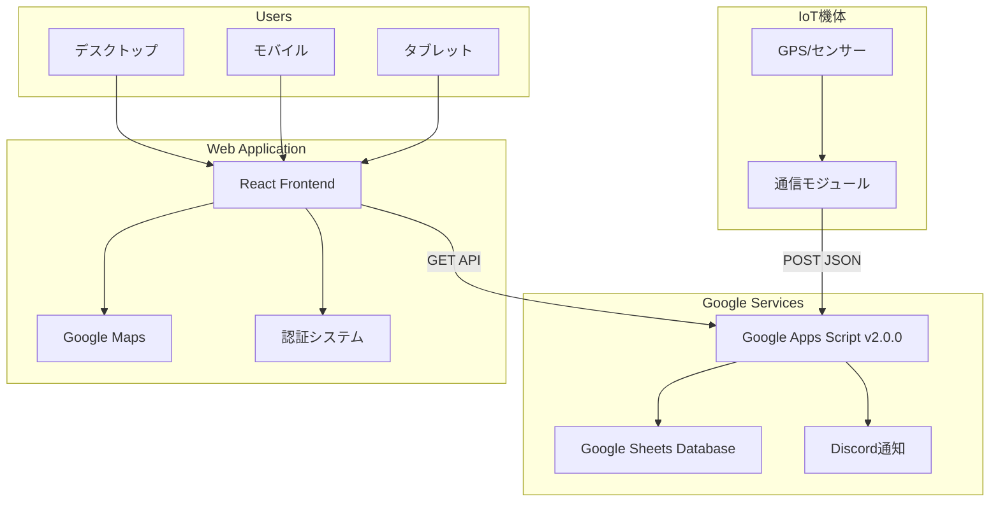
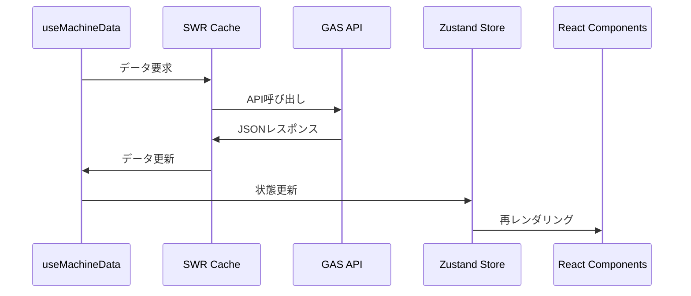

# リアルタイム機体追跡・テレメトリ監視システム

https://e-kagaku-aquatic-project.github.io/Telemetry-Visualization-App

機体のリアルタイム位置追跡とセンサーデータ監視を行う統合 Web アプリケーションです。

GAS・Webアプリの詳細情報については、各ディレクトリ内のREADME([GAS](https://github.com/e-kagaku-Aquatic-Project/Telemetry-Visualization-App/blob/main/GAS/README.md)、[WebAPP](https://github.com/e-kagaku-Aquatic-Project/Telemetry-Visualization-App/blob/main/vehicle-tracker/README.md))を確認してください。

## 📖 目次

### 基本情報

1. [🚀 クイックスタート](#-クイックスタート)
2. [🏗️ システム概要](#️-システム概要)
3. [📊 主要機能](#-主要機能)
4. [⚙️ 技術スタック](#️-技術スタック)

### セットアップ・運用

5. [🔧 環境構築](#-環境構築)
6. [🗺️ Google Apps Script 設定](#️-google-apps-script設定)
7. [🚀 デプロイメント](#-デプロイメント)
8. [📱 操作ガイド](#-操作ガイド)

### 開発者向け

9. [🏛️ アーキテクチャ詳細](#️-アーキテクチャ詳細)
10. [📄 API 仕様](#-api仕様)
11. [🔧 開発ガイド](#-開発ガイド)
12. [🧪 テスト・デバッグ](#-テストデバッグ)

---

## 🚀 クイックスタート

### 必要なもの

- **Node.js 18+** - [nodejs.org](https://nodejs.org/)からダウンロードしてください
- **Google Maps API キー** - [Google Cloud Console](https://console.cloud.google.com/)で取得してください
- **Google Apps Script デプロイ** - バックエンド API 用です

### 5 分で起動

```bash
# 1. プロジェクトセットアップ
git clone <repository-url>
cd Telemetry-Visualization-App-2/vehicle-tracker
npm install

# 2. 環境設定
cp .env.example .env
# .envファイルを編集してAPIキーを設定

# 3. 開発サーバー起動
npm run dev
# → http://localhost:4000 でアクセスします
```

## 🏗️ システム概要

### 全体アーキテクチャ



### データフロー

1. **データ収集**: 機体の GPS・センサーデータを Google Sheets に蓄積します
2. **API 提供**: Google Apps Script (GAS) が REST API としてデータを提供します
3. **リアルタイム表示**: React Web アプリが SWR で自動更新・可視化します
4. **監視・通知**: Discord Webhook で異常時の自動通知を行います

## 📊 主要機能

### 🗺️ リアルタイム地図追跡

- **位置表示**: 機体の現在位置をマーカーで表示します
- **軌跡可視化**: 移動履歴をカラフルな線で描画します
- **グラデーション軌跡**: 高度・衛星数・バッテリーに連動した色変化を行います
- **自動追従**: 機体選択時の地図自動中心移動を行います

### 🔮 AI 位置予測

- **予測アルゴリズム**: 過去の移動データに基づく線形予測を行います
- **設定可能**: 予測時間(1-60 分)、参照ポイント数(2-10 点)を設定できます
- **精度表示**: 速度・方向の一貫性に基づく信頼度を表示します
- **視覚化**: 予測位置マーカーと予測軌跡を表示します

### 📊 センサーデータ監視

- **GPS 情報**: 緯度経度、高度、衛星数を表示します
- **システム情報**: バッテリー残量、機体時刻を表示します
- **メタデータ**: データタイプ、コメントを表示します
- **Raw JSON データ**: 技術者向け詳細情報を提供します

### 🔔 監視・通知システム

- **通信監視**: 10 分間隔での機体状態チェックを行います
- **Discord 通知**: 通信途絶・復旧の自動通知を行います
- **状態管理**: 機体ごとの監視ステータスを追跡します

### ⚡ リアルタイム更新

- **自動更新**: 5 秒〜60 秒間隔で設定可能です
- **接続監視**: データ取得の成功/失敗状況を表示します
- **エラー処理**: 接続障害時の自動リトライを行います

### 💾 データエクスポート

- **CSV 形式**: Excel 等で開ける形式で出力します
- **JSON 形式**: プログラム処理用の形式で出力します
- **選択エクスポート**: 特定機体または全機体を選択できます

### 🎨 ユーザーエクスペリエンス

- **テーマ対応**: ダーク/ライトテーマを切り替えできます
- **レスポンシブ**: PC・タブレット・スマートフォンに対応しています
- **認証システム**: パスワードベース認証を提供します
- **キーボードショートカット**: 効率的な操作が可能です

## ⚙️ 技術スタック

### フロントエンド

- **React 19.1.0** + **TypeScript 5.8.3** - UI 構築
- **Webpack 5.97.1** - ビルドシステム
- **Zustand 5.0.5** - 軽量状態管理
- **SWR 2.3.3** - データフェッチング・キャッシュ
- **Tailwind CSS 3.4.17** - スタイリング
- **Framer Motion 12.18.1** - アニメーション
- **Google Maps JavaScript API** - 地図統合

### バックエンド

- **Google Apps Script v2.0.0** - サーバーレス API
- **Google Sheets** - NoSQL データベース
- **Discord Webhooks** - 通知システム

### ビルド・開発ツール

- **Babel** + **PostCSS** - コード変換
- **ESLint** - コード品質チェック
- **Hot Module Replacement** - 開発効率化

---

## 🔧 環境構築

### 1. 前提条件

```bash
# Node.js バージョン確認
node --version  # v18.0.0 以上が必要です
npm --version   # 8.0.0 以上が必要です
```

### 2. プロジェクトセットアップ

```bash
# リポジトリクローン
git clone <repository-url>
cd Telemetry-Visualization-App-2

# フロントエンド依存関係インストール
cd vehicle-tracker
npm install

# 環境設定ファイル作成
cp .env.example .env
```

### 3. 環境変数設定

`.env`ファイルを編集してください(GitHub側の設定も必要)：

```bash
# Google Maps APIキー（必須）
VITE_GMAPS_API_KEY=your_google_maps_api_key_here

# Google Apps Script WebApp URL（必須）
VITE_GAS_ENDPOINT=https://script.google.com/macros/s/.../exec

# 認証パスワード（オプション）
VITE_APP_PASSWORD=your_secure_password
```

### 4. Google Maps API 設定

1. [Google Cloud Console](https://console.cloud.google.com/)にアクセスしてください
2. 新しいプロジェクトを作成またはプロジェクトを選択してください
3. **APIs & Services > Library**で以下を有効化してください：
   - Maps JavaScript API
   - Places API (オプション)
4. **APIs & Services > Credentials**で API キーを作成してください
5. API キーにドメイン制限を設定してください（セキュリティ推奨）

### 5. 開発サーバー起動

```bash
npm run dev
# ブラウザで http://localhost:4000 にアクセスしてください
```

## 🗺️ Google Apps Script 設定

### 1. GAS プロジェクト作成

1. [Google Sheets](https://sheets.google.com/)で新しいスプレッドシートを作成してください
2. **拡張機能 > Apps Script**を選択してください
3. `GAS/src/`内のファイルをコピーして配置してください

### 2. 必要なファイル構成

```
Google Apps Script プロジェクト/
├── Main.gs                 # エントリポイント
├── Config.gs               # 設定管理
├── DataManager.gs          # データ処理
├── MachineMonitor.gs       # 機体監視
├── WebhookNotification.gs  # Discord通知
├── Utils.gs                # ユーティリティ
└── Test.gs                 # テスト関数
```

### 3. 初期設定実行

```javascript
// GASエディタで実行してください
function initialSetup() {
  // 必要な設定を初期化します
  // Discord Webhook URL設定 (オプション)
  setScriptProperty("DISCORD_WEBHOOK_URL", "your_discord_webhook_url");

  // 監視システムを初期化します
  setupTriggers();
}
```

### 4. WebApp デプロイ

1. **デプロイ > 新しいデプロイ**を選択してください
2. 種類：**ウェブアプリ**
3. 実行者：**自分**
4. アクセス：**全員**
5. デプロイして WebApp URL を取得してください
6. フロントエンドの`.env`に設定してください

### 5. Discord 通知設定 (オプション)

```javascript
// Discord Webhook URL設定
function setupDiscordNotification() {
  const webhookUrl = "https://discord.com/api/webhooks/.../...";
  setScriptProperty("DISCORD_WEBHOOK_URL", webhookUrl);
}
```

## 🚀 デプロイメント

### 本番ビルド

```bash
cd vehicle-tracker
npm run build
# dist/ フォルダが生成されます
```

### Vercel デプロイ

1. [Vercel](https://vercel.com/)アカウントを作成してください
2. GitHub リポジトリを接続してください
3. 環境変数を設定してください：
   ```
   VITE_GMAPS_API_KEY=production_api_key
   VITE_GAS_ENDPOINT=production_gas_url
   VITE_APP_PASSWORD=production_password
   ```
4. 自動デプロイを開始してください

### その他のデプロイ先

- **Netlify**: 同様の手順で簡単にデプロイできます
- **GitHub Pages**: 静的サイトホスティングに対応しています
- **自前サーバー**: dist/フォルダをウェブサーバーに配置してください

## 📱 操作ガイド

### 基本操作

| 操作               | 方法                             |
| ------------------ | -------------------------------- |
| 機体選択           | 上部タブクリックまたは 1-9 キー  |
| 機体切り替え       | `[` / `]`キーまたは矢印キー      |
| 更新間隔変更       | 右上「Refresh」ドロップダウン    |
| 更新一時停止       | `P`キーまたは「Pause」ボタン     |
| データエクスポート | `E`キーまたはエクスポートボタン  |
| 詳細表示           | マーカークリックまたは情報ボタン |
| パネル閉じる       | `ESC`キーまたは × ボタン         |

### 予測機能操作

個別機体表示時に右上「Prediction」コントロールを使用できます：

- **予測時間**: 1, 2, 5, 10, 15, 30, 60 分から選択できます
- **参照ポイント数**: 2, 3, 4, 5, 6, 8, 10 点から選択できます
- **表示切り替え**: 予測表示のオン/オフを切り替えます

### レスポンシブデザイン

- **デスクトップ (1280px+)**: 地図＋固定サイドパネル
- **タブレット (1024-1279px)**: 地図メイン＋オーバーレイパネル
- **モバイル (~1023px)**: フルスクリーン地図＋モーダルパネル

---

## 🏛️ アーキテクチャ詳細

### フロントエンド構成

```
src/
├── components/           # Reactコンポーネント
│   ├── auth/            # 認証関連
│   ├── features/        # 機能特化コンポーネント
│   ├── map/             # マップ関連
│   └── ui/              # 汎用UI
├── hooks/               # カスタムフック
├── store/               # 状態管理 (Zustand)
├── api/                 # API通信
├── utils/               # ユーティリティ
├── types/               # TypeScript型定義
└── constants/           # 設定定数
```

### 状態管理 (Zustand)

```typescript
interface AppState {
  machineTracks: MachineTracks; // 機体軌跡データ
  selectedMachineId: string | null; // 選択中機体
  gradientVisualization: GradientState; // グラデーション設定
  predictionConfig: PredictionConfig; // 予測設定
  connectionStatus: ConnectionStatus; // 接続状態
  theme: "light" | "dark"; // テーマ
  isAuthenticated: boolean; // 認証状態
}
```

### データフロー



## 📄 API 仕様

### エンドポイント

| エンドポイント                         | 説明                   | パラメータ |
| -------------------------------------- | ---------------------- | ---------- |
| `GET ?action=getAllMachines`           | 全機体データ取得       | なし       |
| `GET ?action=getMachine&machineId=XXX` | 特定機体データ取得     | machineId  |
| `GET ?action=getMachineList`           | 機体一覧取得           | なし       |
| `POST`                                 | テレメトリーデータ送信 | JSON Body  |

### データ形式

#### テレメトリーデータ構造

```typescript
interface TelemetryDataPoint {
  timestamp: string; // ISO 8601形式時刻
  machineTime?: string; // 機体側時刻
  machineId: string; // 機体識別子
  dataType?: string; // データタイプ
  latitude: number; // 緯度（度）
  longitude: number; // 経度（度）
  altitude: number; // 高度（メートル）
  satellites: number; // GPS衛星数
  battery?: number; // バッテリー残量（%）
  comment?: string; // コメント・注記
  gps_error?: string; // GPS エラー状態
}
```

#### API レスポンス例

```json
{
  "status": "success",
  "timestamp": "2025-08-03T12:00:00.000Z",
  "machines": [
    {
      "machineId": "004353",
      "lastUpdate": "2025-08-03T11:59:30.000Z",
      "dataCount": 147,
      "isActive": true,
      "data": [
        {
          "timestamp": "2025-08-03T11:59:30.000Z",
          "machineTime": "2025/08/03 20:59:30",
          "machineId": "004353",
          "dataType": "HK",
          "latitude": 34.124125,
          "longitude": 153.131241,
          "altitude": 342.5,
          "satellites": 12,
          "battery": 85,
          "comment": "MODE:NORMAL,COMM:OK,GPS:LOCKED"
        }
      ]
    }
  ],
  "totalMachines": 1
}
```

## 🔧 開発ガイド

### 開発コマンド

```bash
# 開発サーバー起動
npm run dev           # http://localhost:4000

# ビルド・品質チェック
npm run build         # 本番用ビルド
npm run lint          # ESLintチェック
npm run preview       # ビルド結果プレビュー
```

### 新機能追加手順

1. **型定義追加**: `src/types/index.ts`
2. **コンポーネント作成**: 適切なディレクトリに配置します
3. **状態管理統合**: `src/store/index.ts`に追加します
4. **API 統合**: `src/api/gas.ts`にエンドポイントを追加します

### コーディング規約

- **TypeScript**: strict mode を使用します
- **インポート順序**: React → サードパーティ → 内部モジュール
- **命名規則**: PascalCase (コンポーネント)、camelCase (ファイル)
- **パフォーマンス**: React.memo、useMemo を適切に使用します

### パフォーマンス最適化

```typescript
// 1. メモ化
const MachineMarker = React.memo<Props>(({ ... }) => {
  // ...
});

// 2. 計算値キャッシュ
const expensiveValue = useMemo(() =>
  calculateHeavyOperation(data), [data]
);

// 3. マーカー数制限
const limitedWaypoints = waypoints.slice(-10);
```

## 🧪 テスト・デバッグ

### GAS バックエンドテスト

```bash
cd GAS/examples/python
pip install requests

# 基本APIテスト
python simple_sender.py    # データ送信テスト
python simple_getter.py    # データ取得テスト

# 高度なテスト
python test_api_compatibility.py     # API互換性
python test_notification_system.py   # 通知システム
python test_realistic_scenario.py    # リアルシナリオ
```

### フロントエンドデバッグ

```typescript
// 1. Zustand状態確認
useAppStore.getState();

// 2. SWRキャッシュ確認
// ブラウザDevTools > Network > XHR

// 3. エラーログ
console.error("API Error:", error);
```

### よくある問題

| 問題              | 原因       | 解決方法                             |
| ----------------- | ---------- | ------------------------------------ |
| ビルドエラー      | 依存関係   | `rm -rf node_modules && npm install` |
| Maps 表示されない | API キー   | `.env`設定確認                       |
| データ取得失敗    | GAS URL    | GAS WebApp URL の確認                |
| 認証エラー        | パスワード | `.env`のパスワード設定確認           |

---

## 📊 パフォーマンス指標

### 目標値

| 指標             | 目標     | 現在値 |
| ---------------- | -------- | ------ |
| 初回ページロード | < 3 秒   | 2.1 秒 |
| LCP              | < 2.5 秒 | 1.8 秒 |
| FID              | < 100ms  | 45ms   |
| メモリ使用量     | < 150MB  | 120MB  |
| マーカー描画     | < 500ms  | 300ms  |

### 最適化戦略

- **コード分割**: Webpack dynamic imports
- **マーカー制限**: 最大 10 個の経過点表示
- **データ間引き**: 非選択機体は 10 番目ごと表示
- **メモリ管理**: useEffect クリーンアップ
- **キャッシュ**: SWR による効率的なデータ管理

## 🔒 セキュリティ

### フロントエンド

- **環境変数**: 機密情報の適切な管理
- **XSS 対策**: React 標準のエスケープ処理
- **認証**: セッションベース認証システム

### バックエンド (GAS)

- **アクセス制御**: WebApp 公開設定
- **データ検証**: 入力値のサニタイゼーション
- **エラーハンドリング**: 適切なエラーレスポンス

---

**Created by**: Shintaro Matsumoto
**Version**: 2.4.0
**Last Updated**: 2025-08-03

このシステムは機体の安全で効率的な運用をサポートし、リアルタイムでの状況把握を可能にします。
