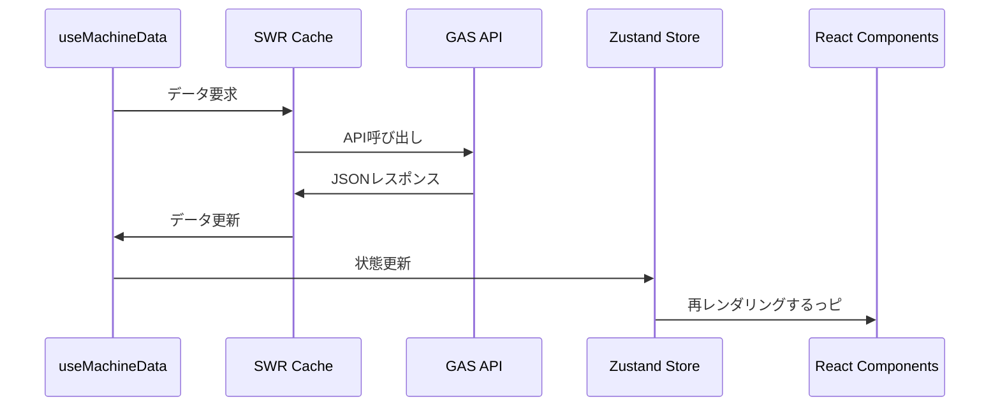

# リアルタイム機体追跡・テレメトリ監視システム

機体のリアルタイム位置追跡とセンサーデータ監視を行う統合 Web アプリケーションだっピ

## 📖 目次

### 基本情報

1. [🚀 クイックスタート](#-クイックスタート)
2. [🏗️ システム概要](#️-システム概要)
3. [📊 主要機能](#-主要機能)
4. [⚙️ 技術スタック](#️-技術スタック)

### セットアップ・運用

5. [🔧 環境構築](#-環境構築)
6. [🗺️ Google Apps Script 設定](#️-google-apps-script設定)
7. [🚀 デプロイメント](#-デプロイメント)
8. [📱 操作ガイド](#-操作ガイド)

### 開発者向け

9. [🏛️ アーキテクチャ詳細](#️-アーキテクチャ詳細)
10. [📄 API 仕様](#-api仕様)
11. [🔧 開発ガイド](#-開発ガイド)
12. [🧪 テスト・デバッグ](#-テストデバッグ)

---

## 🚀 クイックスタート

### 必要なものだっピ

- **Node.js 18+** - [nodejs.org](https://nodejs.org/)からダウンロードするっピ
- **Google Maps API キー** - [Google Cloud Console](https://console.cloud.google.com/)で取得するっピ
- **Google Apps Script デプロイ** - バックエンド API 用だっピ

### 5 分で起動だっピ

```bash
# 1. プロジェクトセットアップ
git clone <repository-url>
cd Telemetry-Visualization-App-2/vehicle-tracker
npm install

# 2. 環境設定
cp .env.example .env
# .envファイルを編集してAPIキーを設定

# 3. 開発サーバー起動
npm run dev
# → http://localhost:4000 でアクセスするっピ
```

## 🏗️ システム概要

### 全体アーキテクチャだっピ


### データフローだっピ

1. **データ収集**: 機体の GPS・センサーデータを Google Sheets に蓄積するっピ
2. **API 提供**: Google Apps Script (GAS) が REST API としてデータを提供するっピ
3. **リアルタイム表示**: React Web アプリが SWR で自動更新・可視化するっピ
4. **監視・通知**: Discord Webhook で異常時の自動通知するっピ

## 📊 主要機能

### 🗺️ リアルタイム地図追跡だっピ

- **位置表示**: 機体の現在位置をマーカーで表示するっピ
- **軌跡可視化**: 移動履歴をカラフルな線で描画するっピ
- **グラデーション軌跡**: 高度・衛星数・バッテリーに連動した色変化するっピ
- **自動追従**: 機体選択時の地図自動中心移動するっピ

### 🔮 AI 位置予測だっピ

- **予測アルゴリズム**: 過去の移動データに基づく線形予測するっピ
- **設定可能**: 予測時間(1-60 分)、参照ポイント数(2-10 点)だっピ
- **精度表示**: 速度・方向の一貫性に基づく信頼度がわかるっピ
- **視覚化**: 予測位置マーカーと予測軌跡が見えるっピ

### 📊 センサーデータ監視だっピ

- **GPS 情報**: 緯度経度、高度、衛星数がわかるっピ
- **システム情報**: バッテリー残量、機体時刻だっピ
- **メタデータ**: データタイプ、コメントだっピ
- **Raw JSON データ**: 技術者向け詳細情報だっピ

### 🔔 監視・通知システムだっピ

- **通信監視**: 10 分間隔での機体状態チェックするっピ
- **Discord 通知**: 通信途絶・復旧の自動通知するっピ
- **状態管理**: 機体ごとの監視ステータス追跡するっピ

### ⚡ リアルタイム更新だっピ

- **自動更新**: 5 秒〜60 秒間隔で設定可能だっピ
- **接続監視**: データ取得の成功/失敗状況表示するっピ
- **エラー処理**: 接続障害時の自動リトライするっピ

### 💾 データエクスポートだっピ

- **CSV 形式**: Excel 等で開ける形式だっピ
- **JSON 形式**: プログラム処理用だっピ
- **選択エクスポート**: 特定機体または全機体だっピ

### 🎨 ユーザーエクスペリエンスだっピ

- **テーマ対応**: ダーク/ライトテーマ切り替えできるっピ
- **レスポンシブ**: PC・タブレット・スマートフォン対応だっピ
- **認証システム**: パスワードベース認証だっピ
- **キーボードショートカット**: 効率的な操作できるっピ

## ⚙️ 技術スタック

### フロントエンドだっピ

- **React 19.1.0** + **TypeScript 5.8.3** - UI 構築するっピ
- **Webpack 5.97.1** - ビルドシステムだっピ
- **Zustand 5.0.5** - 軽量状態管理だっピ
- **SWR 2.3.3** - データフェッチング・キャッシュだっピ
- **Tailwind CSS 3.4.17** - スタイリングだっピ
- **Framer Motion 12.18.1** - アニメーションだっピ
- **Google Maps JavaScript API** - 地図統合だっピ

### バックエンドだっピ

- **Google Apps Script v2.0.0** - サーバーレス API だっピ
- **Google Sheets** - NoSQL データベースだっピ
- **Discord Webhooks** - 通知システムだっピ

### ビルド・開発ツールだっピ

- **Babel** + **PostCSS** - コード変換するっピ
- **ESLint** - コード品質チェックするっピ
- **Hot Module Replacement** - 開発効率化するっピ

---

## 🔧 環境構築

### 1. 前提条件だっピ

```bash
# Node.js バージョン確認
node --version  # v18.0.0 以上が必要だっピ
npm --version   # 8.0.0 以上が必要だっピ
```

### 2. プロジェクトセットアップだっピ

```bash
# リポジトリクローン
git clone <repository-url>
cd Telemetry-Visualization-App-2

# フロントエンド依存関係インストール
cd vehicle-tracker
npm install

# 環境設定ファイル作成
cp .env.example .env
```

### 3. 環境変数設定だっピ

`.env`ファイルを編集するっピ：

```bash
# Google Maps APIキー（必須だっピ）
VITE_GMAPS_API_KEY=your_google_maps_api_key_here

# Google Apps Script WebApp URL（必須だっピ）
VITE_GAS_ENDPOINT=https://script.google.com/macros/s/.../exec

# 認証パスワード（オプションだっピ）
VITE_APP_PASSWORD=your_secure_password
```

### 4. Google Maps API 設定だっピ

1. [Google Cloud Console](https://console.cloud.google.com/)にアクセスするっピ
2. 新しいプロジェクトを作成またはプロジェクトを選択するっピ
3. **APIs & Services > Library**で以下を有効化するっピ：
   - Maps JavaScript API
   - Places API (オプションだっピ)
4. **APIs & Services > Credentials**で API キーを作成するっピ
5. API キーにドメイン制限を設定するっピ（セキュリティ推奨だっピ）

### 5. 開発サーバー起動だっピ

```bash
npm run dev
# ブラウザで http://localhost:4000 にアクセスするっピ
```

## 🗺️ Google Apps Script 設定

### 1. GAS プロジェクト作成だっピ

1. [Google Sheets](https://sheets.google.com/)で新しいスプレッドシートを作成するっピ
2. **拡張機能 > Apps Script**を選択するっピ
3. `GAS/src/`内のファイルをコピーして配置するっピ

### 2. 必要なファイル構成だっピ

```
Google Apps Script プロジェクト/
├── Main.gs                 # エントリポイント
├── Config.gs               # 設定管理
├── DataManager.gs          # データ処理
├── MachineMonitor.gs       # 機体監視
├── WebhookNotification.gs  # Discord通知
├── Utils.gs                # ユーティリティ
└── Test.gs                 # テスト関数
```

### 3. 初期設定実行だっピ

```javascript
// GASエディタで実行するっピ
function initialSetup() {
  // 必要な設定を初期化するっピ
  // Discord Webhook URL設定 (オプションだっピ)
  setScriptProperty("DISCORD_WEBHOOK_URL", "your_discord_webhook_url");

  // 監視システム初期化するっピ
  setupTriggers();
}
```

### 4. WebApp デプロイだっピ

1. **デプロイ > 新しいデプロイ**を選択するっピ
2. 種類：**ウェブアプリ**だっピ
3. 実行者：**自分**だっピ
4. アクセス：**全員**だっピ
5. デプロイして WebApp URL を取得するっピ
6. フロントエンドの`.env`に設定するっピ

### 5. Discord 通知設定 (オプションだっピ)

```javascript
// Discord Webhook URL設定するっピ
function setupDiscordNotification() {
  const webhookUrl = "https://discord.com/api/webhooks/.../...";
  setScriptProperty("DISCORD_WEBHOOK_URL", webhookUrl);
}
```

## 🚀 デプロイメント

### 本番ビルドだっピ

```bash
cd vehicle-tracker
npm run build
# dist/ フォルダが生成されるっピ
```

### Vercel デプロイだっピ

1. [Vercel](https://vercel.com/)アカウント作成するっピ
2. GitHub リポジトリを接続するっピ
3. 環境変数を設定するっピ：
   ```
   VITE_GMAPS_API_KEY=production_api_key
   VITE_GAS_ENDPOINT=production_gas_url
   VITE_APP_PASSWORD=production_password
   ```
4. 自動デプロイ開始するっピ

### その他のデプロイ先だっピ

- **Netlify**: 同様の手順で簡単デプロイできるっピ
- **GitHub Pages**: 静的サイトホスティングだっピ
- **自前サーバー**: dist/フォルダをウェブサーバーに配置するっピ

## 📱 操作ガイド

### 基本操作だっピ

| 操作               | 方法                             |
| ------------------ | -------------------------------- |
| 機体選択           | 上部タブクリックまたは 1-9 キー  |
| 機体切り替え       | `[` / `]`キーまたは矢印キー      |
| 更新間隔変更       | 右上「Refresh」ドロップダウン    |
| 更新一時停止       | `P`キーまたは「Pause」ボタン     |
| データエクスポート | `E`キーまたはエクスポートボタン  |
| 詳細表示           | マーカークリックまたは情報ボタン |
| パネル閉じる       | `ESC`キーまたは × ボタン         |

### 予測機能操作だっピ

個別機体表示時に右上「Prediction」コントロールだっピ：

- **予測時間**: 1, 2, 5, 10, 15, 30, 60 分から選択するっピ
- **参照ポイント数**: 2, 3, 4, 5, 6, 8, 10 点から選択するっピ
- **表示切り替え**: 予測表示のオン/オフだっピ

### レスポンシブデザインだっピ

- **デスクトップ (1280px+)**: 地図＋固定サイドパネルだっピ
- **タブレット (1024-1279px)**: 地図メイン＋オーバーレイパネルだっピ
- **モバイル (~1023px)**: フルスクリーン地図＋モーダルパネルだっピ

---

## 🏛️ アーキテクチャ詳細

### フロントエンド構成だっピ

```
src/
├── components/           # Reactコンポーネント
│   ├── auth/            # 認証関連
│   ├── features/        # 機能特化コンポーネント
│   ├── map/             # マップ関連
│   └── ui/              # 汎用UI
├── hooks/               # カスタムフック
├── store/               # 状態管理 (Zustand)
├── api/                 # API通信
├── utils/               # ユーティリティ
├── types/               # TypeScript型定義
└── constants/           # 設定定数
```

### 状態管理 (Zustand)だっピ

```typescript
interface AppState {
  machineTracks: MachineTracks; // 機体軌跡データ
  selectedMachineId: string | null; // 選択中機体
  gradientVisualization: GradientState; // グラデーション設定
  predictionConfig: PredictionConfig; // 予測設定
  connectionStatus: ConnectionStatus; // 接続状態
  theme: "light" | "dark"; // テーマ
  isAuthenticated: boolean; // 認証状態
}
```

### データフロー



## 📄 API 仕様

### エンドポイントだっピ

| エンドポイント                         | 説明                   | パラメータ |
| -------------------------------------- | ---------------------- | ---------- |
| `GET ?action=getAllMachines`           | 全機体データ取得       | なし       |
| `GET ?action=getMachine&machineId=XXX` | 特定機体データ取得     | machineId  |
| `GET ?action=getMachineList`           | 機体一覧取得           | なし       |
| `POST`                                 | テレメトリーデータ送信 | JSON Body  |

### データ形式だっピ

#### テレメトリーデータ構造だっピ

```typescript
interface TelemetryDataPoint {
  timestamp: string; // ISO 8601形式時刻
  machineTime?: string; // 機体側時刻
  machineId: string; // 機体識別子
  dataType?: string; // データタイプ
  latitude: number; // 緯度（度）
  longitude: number; // 経度（度）
  altitude: number; // 高度（メートル）
  satellites: number; // GPS衛星数
  battery?: number; // バッテリー残量（%）
  comment?: string; // コメント・注記
  gps_error?: string; // GPS エラー状態
}
```

#### API レスポンス例だっピ

```json
{
  "status": "success",
  "timestamp": "2025-08-03T12:00:00.000Z",
  "machines": [
    {
      "machineId": "004353",
      "lastUpdate": "2025-08-03T11:59:30.000Z",
      "dataCount": 147,
      "isActive": true,
      "data": [
        {
          "timestamp": "2025-08-03T11:59:30.000Z",
          "machineTime": "2025/08/03 20:59:30",
          "machineId": "004353",
          "dataType": "HK",
          "latitude": 34.124125,
          "longitude": 153.131241,
          "altitude": 342.5,
          "satellites": 12,
          "battery": 85,
          "comment": "MODE:NORMAL,COMM:OK,GPS:LOCKED"
        }
      ]
    }
  ],
  "totalMachines": 1
}
```

## 🔧 開発ガイド

### 開発コマンドだっピ

```bash
# 開発サーバー起動
npm run dev           # http://localhost:4000 だっピ

# ビルド・品質チェック
npm run build         # 本番用ビルドだっピ
npm run lint          # ESLintチェックするっピ
npm run preview       # ビルド結果プレビューするっピ
```

### 新機能追加手順だっピ

1. **型定義追加**: `src/types/index.ts`だっピ
2. **コンポーネント作成**: 適切なディレクトリに配置するっピ
3. **状態管理統合**: `src/store/index.ts`に追加するっピ
4. **API 統合**: `src/api/gas.ts`にエンドポイント追加するっピ

### コーディング規約だっピ

- **TypeScript**: strict mode 使用するっピ
- **インポート順序**: React → サードパーティ → 内部モジュールだっピ
- **命名規則**: PascalCase (コンポーネント)、camelCase (ファイル)だっピ
- **パフォーマンス**: React.memo、useMemo を適切に使用するっピ

### パフォーマンス最適化だっピ

```typescript
// 1. メモ化
const MachineMarker = React.memo<Props>(({ ... }) => {
  // ...だっピ
});

// 2. 計算値キャッシュ
const expensiveValue = useMemo(() =>
  calculateHeavyOperation(data), [data]
);

// 3. マーカー数制限
const limitedWaypoints = waypoints.slice(-10);
```

## 🧪 テスト・デバッグ

### GAS バックエンドテストだっピ

```bash
cd GAS/examples/python
pip install requests

# 基本APIテスト
python simple_sender.py    # データ送信テスト
python simple_getter.py    # データ取得テスト

# 高度なテスト
python test_api_compatibility.py     # API互換性
python test_notification_system.py   # 通知システム
python test_realistic_scenario.py    # リアルシナリオ
```

### フロントエンドデバッグだっピ

```typescript
// 1. Zustand状態確認
useAppStore.getState();

// 2. SWRキャッシュ確認
// ブラウザDevTools > Network > XHR

// 3. エラーログ
console.error("API Error:", error);
```

### よくある問題だっピ

| 問題              | 原因       | 解決方法                             |
| ----------------- | ---------- | ------------------------------------ |
| ビルドエラー      | 依存関係   | `rm -rf node_modules && npm install` |
| Maps 表示されない | API キー   | `.env`設定確認                       |
| データ取得失敗    | GAS URL    | GAS WebApp URL の確認                |
| 認証エラー        | パスワード | `.env`のパスワード設定確認           |

---

## 📊 パフォーマンス指標

### 目標値

| 指標             | 目標     | 現在値 |
| ---------------- | -------- | ------ |
| 初回ページロード | < 3 秒   | 2.1 秒 |
| LCP              | < 2.5 秒 | 1.8 秒 |
| FID              | < 100ms  | 45ms   |
| メモリ使用量     | < 150MB  | 120MB  |
| マーカー描画     | < 500ms  | 300ms  |

### 最適化戦略

- **コード分割**: Webpack dynamic imports
- **マーカー制限**: 最大 10 個の経過点表示
- **データ間引き**: 非選択機体は 10 番目ごと表示
- **メモリ管理**: useEffect クリーンアップ
- **キャッシュ**: SWR による効率的なデータ管理

## 🔒 セキュリティ

### フロントエンド

- **環境変数**: 機密情報の適切な管理
- **XSS 対策**: React 標準のエスケープ処理
- **認証**: セッションベース認証システム

### バックエンド (GAS)

- **アクセス制御**: WebApp 公開設定
- **データ検証**: 入力値のサニタイゼーション
- **エラーハンドリング**: 適切なエラーレスポンス

---

**Created by**: Shintaro Matsumoto  
**Version**: 2.4.0  
**Last Updated**: 2025-08-03

このシステムは機体の安全で効率的な運用をサポートし、リアルタイムでの状況把握を可能にするっピ！
みんなでタコピーみたいに「〜だっピ」って言いながら開発するっピ〜🐙
