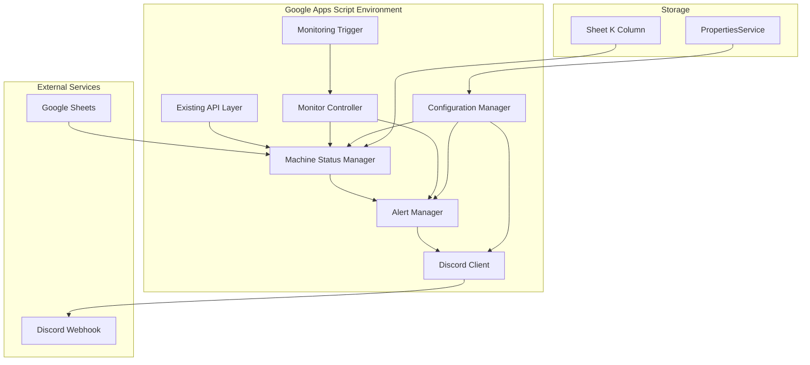

# Discord Monitoring System - Detailed Design Specification

## Document Information

- **Document Type**: Detailed Design Specification
- **Version**: 1.0.0
- **Date**: 2025-07-21
- **Author**: Development Team
- **Related Documents**: discord-monitoring-requirements.md
- **Status**: Draft

---

## 1. System Architecture

### 1.1 Overall Architecture



### 1.2 Component Overview

| Component | Responsibility | Key Functions |
|-----------|----------------|---------------|
| **Machine Status Manager** | Operational status handling | `getOperationalStatus()`, `getAllActiveMachines()` |
| **Alert Manager** | Notification logic and history | `processAlerts()`, `checkAlertHistory()` |
| **Discord Client** | Discord API integration | `sendDiscordNotification()`, `createEmbed()` |
| **Monitor Controller** | Orchestrates monitoring cycle | `executeMonitoring()`, `identifyStaleMachines()` |
| **Configuration Manager** | Settings and secrets management | `getConfig()`, `setWebhookUrl()` |

---

## 2. Data Design

### 2.1 Sheet Structure Enhancement

#### Current Structure (A-J columns):
```
A: GAS Time
B: MachineTime  
C: MachineID
D: DataType
E: Latitude
F: Longitude
G: Altitude
H: GPS Satellites
I: Battery
J: Comment
```

#### Enhanced Structure (A-K columns):
```
A: GAS Time
B: MachineTime  
C: MachineID
D: DataType
E: Latitude
F: Longitude
G: Altitude
H: GPS Satellites
I: Battery
J: Comment
K: Operational Status (NEW)
```

#### K1 Cell Specification:
- **Data Type**: String with validation
- **Allowed Values**: ["Active", "Inactive", "Maintenance"]
- **Default Value**: "Inactive"
- **Validation**: Dropdown list with error on invalid input
- **Access**: Manual editing only (no programmatic changes)

### 2.2 Configuration Data Schema

#### PropertiesService Keys:
```typescript
interface ConfigurationKeys {
  DISCORD_WEBHOOK_URL: string;           // Encrypted webhook URL
  MONITORING_ENABLED: "true" | "false";  // Monitoring state
  ALERT_THRESHOLD_MINUTES: string;       // Default: "10"
  ALERT_COOLDOWN_HOURS: string;         // Default: "24" 
  ALERT_HISTORY: string;                // JSON string of alert history
}
```

#### Alert History Schema:
```typescript
interface AlertHistoryRecord {
  machineId: string;
  lastAlertTime: string;        // ISO timestamp
  isCurrentlyAlerting: boolean;
  lastRecoveryTime?: string;    // ISO timestamp
  alertCount: number;
  lastUpdateTime: string;       // ISO timestamp
}

type AlertHistory = AlertHistoryRecord[];
```

### 2.3 Discord Message Schema

#### Alert Notification:
```json
{
  "embeds": [{
    "title": "🚨 Machine Alert",
    "description": "Machine has stopped transmitting data",
    "color": 16711680,
    "fields": [
      {
        "name": "Machine ID",
        "value": "00453",
        "inline": true
      },
      {
        "name": "Last Update", 
        "value": "2025-07-21 14:30:25 JST",
        "inline": true
      },
      {
        "name": "Offline Duration",
        "value": "15 minutes",
        "inline": true
      }
    ],
    "timestamp": "2025-07-21T05:45:25.000Z",
    "footer": {
      "text": "Machine Telemetry Monitor",
      "icon_url": "https://example.com/alert-icon.png"
    }
  }]
}
```

#### Recovery Notification:
```json
{
  "embeds": [{
    "title": "✅ Machine Recovery",
    "description": "Machine has resumed data transmission",
    "color": 65280,
    "fields": [
      {
        "name": "Machine ID",
        "value": "00453", 
        "inline": true
      },
      {
        "name": "Resumed At",
        "value": "2025-07-21 15:10:15 JST",
        "inline": true
      },
      {
        "name": "Offline Duration", 
        "value": "40 minutes",
        "inline": true
      }
    ],
    "timestamp": "2025-07-21T06:10:15.000Z",
    "footer": {
      "text": "Machine Telemetry Monitor"
    }
  }]
}
```

---

## 3. Function Design

### 3.1 Core Monitoring Functions

#### 3.1.1 Main Monitoring Controller

```javascript
/**
 * Main monitoring execution function (called by trigger)
 * Orchestrates the complete monitoring cycle
 */
function executeMonitoring() {
  try {
    Logger.log("Starting monitoring cycle");
    
    // Check if monitoring is enabled
    if (!isMonitoringEnabled()) {
      Logger.log("Monitoring disabled, skipping cycle");
      return;
    }
    
    // Get current monitoring state
    const staleMachines = identifyStaleMachines();
    const recoveredMachines = identifyRecoveredMachines();
    
    Logger.log(`Found ${staleMachines.length} stale machines, ${recoveredMachines.length} recovered machines`);
    
    // Process alerts for stale machines
    staleMachines.forEach(machine => {
      processStaleMachineAlert(machine);
    });
    
    // Process recovery notifications
    recoveredMachines.forEach(machine => {
      processRecoveryAlert(machine);
    });
    
    // Update alert history
    updateAlertHistory(staleMachines, recoveredMachines);
    
    Logger.log("Monitoring cycle completed successfully");
    
  } catch (error) {
    Logger.log(`Monitoring error: ${error.toString()}`);
    // Don't re-throw to prevent trigger deletion
  }
}
```

#### 3.1.2 Stale Machine Detection

```javascript
/**
 * Identify machines that are active but have stale data
 * @returns {Array<Object>} Array of stale machine objects
 */
function identifyStaleMachines() {
  const activeMachines = getAllActiveMachines();
  const currentTime = new Date();
  const thresholdMinutes = getAlertThresholdMinutes();
  const thresholdMs = thresholdMinutes * 60 * 1000;
  
  return activeMachines.filter(machine => {
    if (!machine.lastUpdate) return false;
    
    const lastUpdateTime = new Date(machine.lastUpdate);
    const elapsedMs = currentTime - lastUpdateTime;
    
    return elapsedMs > thresholdMs;
  });
}

/**
 * Get all machines with operational status "Active"
 * @returns {Array<Object>} Array of active machine objects
 */
function getAllActiveMachines() {
  const spreadsheet = SpreadsheetApp.getActiveSpreadsheet();
  const sheets = spreadsheet.getSheets();
  const activeMachines = [];
  
  sheets.forEach(sheet => {
    const sheetName = sheet.getName();
    if (!sheetName.startsWith("Machine_")) return;
    
    try {
      // Check operational status in K1
      const statusValue = sheet.getRange(1, 11).getValue();
      if (statusValue !== "Active") return;
      
      const machineId = sheetName.replace("Machine_", "");
      const lastUpdate = getLastUpdateTime(sheet);
      
      if (lastUpdate) {
        activeMachines.push({
          machineId: machineId,
          sheetName: sheetName,
          lastUpdate: lastUpdate,
          status: statusValue
        });
      }
    } catch (error) {
      Logger.log(`Error processing sheet ${sheetName}: ${error.toString()}`);
    }
  });
  
  return activeMachines;
}
```

#### 3.1.3 Recovery Detection

```javascript
/**
 * Identify machines that have recovered from stale state
 * @returns {Array<Object>} Array of recovered machine objects
 */
function identifyRecoveredMachines() {
  const alertHistory = getAlertHistory();
  const currentlyAlertingMachines = alertHistory.filter(record => record.isCurrentlyAlerting);
  
  if (currentlyAlertingMachines.length === 0) {
    return [];
  }
  
  const activeMachines = getAllActiveMachines();
  const thresholdMinutes = getAlertThresholdMinutes();
  const thresholdMs = thresholdMinutes * 60 * 1000;
  const currentTime = new Date();
  
  return currentlyAlertingMachines.filter(alertRecord => {
    const activeMachine = activeMachines.find(m => m.machineId === alertRecord.machineId);
    
    if (!activeMachine) return false; // Machine no longer active
    
    const lastUpdateTime = new Date(activeMachine.lastUpdate);
    const elapsedMs = currentTime - lastUpdateTime;
    
    // Machine is considered recovered if it's within threshold
    return elapsedMs <= thresholdMs;
  }).map(alertRecord => {
    const activeMachine = activeMachines.find(m => m.machineId === alertRecord.machineId);
    return {
      ...activeMachine,
      previousAlertTime: alertRecord.lastAlertTime,
      offlineDuration: calculateOfflineDuration(alertRecord.lastAlertTime, activeMachine.lastUpdate)
    };
  });
}
```

### 3.2 Alert Processing Functions

#### 3.2.1 Stale Machine Alert Processing

```javascript
/**
 * Process alert for a stale machine
 * @param {Object} machine - Stale machine object
 */
function processStaleMachineAlert(machine) {
  try {
    const alertHistory = getAlertHistory();
    const existingRecord = alertHistory.find(record => record.machineId === machine.machineId);
    
    // Check cooldown period
    if (existingRecord && isInCooldownPeriod(existingRecord.lastAlertTime)) {
      Logger.log(`Machine ${machine.machineId} still in cooldown period`);
      return;
    }
    
    // Calculate offline duration
    const currentTime = new Date();
    const lastUpdateTime = new Date(machine.lastUpdate);
    const offlineDurationMs = currentTime - lastUpdateTime;
    const offlineDurationText = formatDuration(offlineDurationMs);
    
    // Send Discord notification
    const alertDetails = {
      machineId: machine.machineId,
      lastUpdate: formatTimestampForDisplay(machine.lastUpdate),
      offlineDuration: offlineDurationText,
      alertTime: currentTime.toISOString()
    };
    
    const notificationSent = sendStaleAlert(alertDetails);
    
    if (notificationSent) {
      Logger.log(`Stale alert sent for machine ${machine.machineId}`);
      
      // Update alert history
      updateMachineAlertRecord(machine.machineId, {
        lastAlertTime: currentTime.toISOString(),
        isCurrentlyAlerting: true,
        alertCount: (existingRecord?.alertCount || 0) + 1,
        lastUpdateTime: machine.lastUpdate
      });
    } else {
      Logger.log(`Failed to send stale alert for machine ${machine.machineId}`);
    }
    
  } catch (error) {
    Logger.log(`Error processing stale alert for ${machine.machineId}: ${error.toString()}`);
  }
}

/**
 * Process recovery alert for a recovered machine
 * @param {Object} machine - Recovered machine object
 */
function processRecoveryAlert(machine) {
  try {
    const recoveryDetails = {
      machineId: machine.machineId,
      resumedAt: formatTimestampForDisplay(machine.lastUpdate),
      offlineDuration: machine.offlineDuration,
      recoveryTime: new Date().toISOString()
    };
    
    const notificationSent = sendRecoveryAlert(recoveryDetails);
    
    if (notificationSent) {
      Logger.log(`Recovery alert sent for machine ${machine.machineId}`);
      
      // Update alert history
      updateMachineAlertRecord(machine.machineId, {
        isCurrentlyAlerting: false,
        lastRecoveryTime: new Date().toISOString(),
        lastUpdateTime: machine.lastUpdate
      });
    } else {
      Logger.log(`Failed to send recovery alert for machine ${machine.machineId}`);
    }
    
  } catch (error) {
    Logger.log(`Error processing recovery alert for ${machine.machineId}: ${error.toString()}`);
  }
}
```

### 3.3 Discord Integration Functions

#### 3.3.1 Discord Notification Sender

```javascript
/**
 * Send stale machine alert to Discord
 * @param {Object} details - Alert details
 * @returns {boolean} Success status
 */
function sendStaleAlert(details) {
  const embed = createStaleAlertEmbed(details);
  return sendDiscordNotification(embed);
}

/**
 * Send recovery notification to Discord
 * @param {Object} details - Recovery details  
 * @returns {boolean} Success status
 */
function sendRecoveryAlert(details) {
  const embed = createRecoveryEmbed(details);
  return sendDiscordNotification(embed);
}

/**
 * Send notification to Discord via webhook
 * @param {Object} embed - Discord embed object
 * @returns {boolean} Success status
 */
function sendDiscordNotification(embed) {
  try {
    const webhookUrl = getDiscordWebhookUrl();
    if (!webhookUrl) {
      Logger.log("Discord webhook URL not configured");
      return false;
    }
    
    const payload = {
      embeds: [embed]
    };
    
    const response = UrlFetchApp.fetch(webhookUrl, {
      method: 'POST',
      headers: {
        'Content-Type': 'application/json'
      },
      payload: JSON.stringify(payload),
      muteHttpExceptions: true
    });
    
    const responseCode = response.getResponseCode();
    
    if (responseCode === 204) {
      Logger.log("Discord notification sent successfully");
      return true;
    } else {
      Logger.log(`Discord notification failed: HTTP ${responseCode} - ${response.getContentText()}`);
      return false;
    }
    
  } catch (error) {
    Logger.log(`Discord notification error: ${error.toString()}`);
    return false;
  }
}
```

#### 3.3.2 Discord Embed Creators

```javascript
/**
 * Create Discord embed for stale machine alert
 * @param {Object} details - Alert details
 * @returns {Object} Discord embed object
 */
function createStaleAlertEmbed(details) {
  return {
    title: "🚨 Machine Alert",
    description: "Machine has stopped transmitting data",
    color: 16711680, // Red
    fields: [
      {
        name: "Machine ID",
        value: details.machineId,
        inline: true
      },
      {
        name: "Last Update",
        value: details.lastUpdate,
        inline: true
      },
      {
        name: "Offline Duration", 
        value: details.offlineDuration,
        inline: true
      }
    ],
    timestamp: details.alertTime,
    footer: {
      text: "Machine Telemetry Monitor"
    }
  };
}

/**
 * Create Discord embed for machine recovery
 * @param {Object} details - Recovery details
 * @returns {Object} Discord embed object
 */
function createRecoveryEmbed(details) {
  return {
    title: "✅ Machine Recovery",
    description: "Machine has resumed data transmission", 
    color: 65280, // Green
    fields: [
      {
        name: "Machine ID",
        value: details.machineId,
        inline: true
      },
      {
        name: "Resumed At",
        value: details.resumedAt,
        inline: true
      },
      {
        name: "Offline Duration",
        value: details.offlineDuration,
        inline: true
      }
    ],
    timestamp: details.recoveryTime,
    footer: {
      text: "Machine Telemetry Monitor"
    }
  };
}
```

### 3.4 Configuration Management Functions

#### 3.4.1 Configuration Getters/Setters

```javascript
/**
 * Set Discord webhook URL
 * @param {string} url - Discord webhook URL
 */
function setDiscordWebhookUrl(url) {
  if (!url || typeof url !== 'string') {
    throw new Error('Invalid webhook URL provided');
  }
  
  if (!url.startsWith('https://discord.com/api/webhooks/')) {
    throw new Error('Invalid Discord webhook URL format');
  }
  
  PropertiesService.getScriptProperties().setProperty('DISCORD_WEBHOOK_URL', url);
  Logger.log('Discord webhook URL configured successfully');
}

/**
 * Get Discord webhook URL
 * @returns {string|null} Webhook URL or null if not configured
 */
function getDiscordWebhookUrl() {
  return PropertiesService.getScriptProperties().getProperty('DISCORD_WEBHOOK_URL');
}

/**
 * Enable or disable monitoring
 * @param {boolean} enabled - Monitoring state
 */
function setMonitoringEnabled(enabled) {
  PropertiesService.getScriptProperties().setProperty('MONITORING_ENABLED', enabled.toString());
  Logger.log(`Monitoring ${enabled ? 'enabled' : 'disabled'}`);
}

/**
 * Check if monitoring is enabled
 * @returns {boolean} Monitoring state
 */
function isMonitoringEnabled() {
  const enabled = PropertiesService.getScriptProperties().getProperty('MONITORING_ENABLED');
  return enabled === 'true';
}

/**
 * Set alert threshold in minutes
 * @param {number} minutes - Threshold in minutes
 */
function setAlertThresholdMinutes(minutes) {
  if (minutes < 1 || minutes > 1440) { // 1 minute to 24 hours
    throw new Error('Alert threshold must be between 1 and 1440 minutes');
  }
  
  PropertiesService.getScriptProperties().setProperty('ALERT_THRESHOLD_MINUTES', minutes.toString());
  Logger.log(`Alert threshold set to ${minutes} minutes`);
}

/**
 * Get alert threshold in minutes
 * @returns {number} Threshold in minutes (default: 10)
 */
function getAlertThresholdMinutes() {
  const threshold = PropertiesService.getScriptProperties().getProperty('ALERT_THRESHOLD_MINUTES');
  return threshold ? parseInt(threshold) : 10;
}
```

#### 3.4.2 Alert History Management

```javascript
/**
 * Get alert history from PropertiesService
 * @returns {Array<Object>} Alert history records
 */
function getAlertHistory() {
  try {
    const historyJson = PropertiesService.getScriptProperties().getProperty('ALERT_HISTORY');
    return historyJson ? JSON.parse(historyJson) : [];
  } catch (error) {
    Logger.log(`Error reading alert history: ${error.toString()}`);
    return [];
  }
}

/**
 * Save alert history to PropertiesService
 * @param {Array<Object>} history - Alert history records
 */
function saveAlertHistory(history) {
  try {
    const historyJson = JSON.stringify(history);
    PropertiesService.getScriptProperties().setProperty('ALERT_HISTORY', historyJson);
  } catch (error) {
    Logger.log(`Error saving alert history: ${error.toString()}`);
  }
}

/**
 * Update alert record for a specific machine
 * @param {string} machineId - Machine ID
 * @param {Object} updates - Update object
 */
function updateMachineAlertRecord(machineId, updates) {
  const history = getAlertHistory();
  const existingIndex = history.findIndex(record => record.machineId === machineId);
  
  if (existingIndex >= 0) {
    // Update existing record
    history[existingIndex] = { ...history[existingIndex], ...updates };
  } else {
    // Create new record
    history.push({
      machineId: machineId,
      isCurrentlyAlerting: false,
      alertCount: 0,
      ...updates
    });
  }
  
  saveAlertHistory(history);
}

/**
 * Clear all alert history (maintenance function)
 */
function clearAlertHistory() {
  PropertiesService.getScriptProperties().deleteProperty('ALERT_HISTORY');
  Logger.log('Alert history cleared');
}
```

### 3.5 Enhanced Sheet Management

#### 3.5.1 Modified createNewSheet Function

```javascript
/**
 * Create new machine sheet with operational status column
 * @param {Spreadsheet} spreadsheet - Target spreadsheet
 * @param {string} sheetName - Sheet name
 * @returns {Sheet} Created sheet
 */
function createNewSheet(spreadsheet, sheetName) {
  // Create new sheet
  const sheet = spreadsheet.insertSheet(sheetName);

  // Enhanced headers including operational status
  const headers = [
    "GAS Time",
    "MachineTime", 
    "MachineID",
    "DataType",
    "Latitude",
    "Longitude", 
    "Altitude",
    "GPS Satellites",
    "Battery",
    "Comment",
    "Operational Status"  // New column K
  ];

  // Set headers
  sheet.getRange(1, 1, 1, headers.length).setValues([headers]);

  // Header formatting
  const headerRange = sheet.getRange(1, 1, 1, headers.length);
  headerRange.setBackground("#4285f4");
  headerRange.setFontColor("white");
  headerRange.setFontWeight("bold");

  // Set up operational status validation in K1
  const validationRule = SpreadsheetApp.newDataValidation()
    .requireValueInList(['Active', 'Inactive', 'Maintenance'], true)
    .setAllowInvalid(false)
    .setHelpText('Select operational status for monitoring')
    .build();

  const statusCell = sheet.getRange(1, 11); // K1
  statusCell.setDataValidation(validationRule);
  statusCell.setValue('Inactive'); // Default value
  
  // Special formatting for status cell
  statusCell.setBackground("#f0f0f0");
  statusCell.setHorizontalAlignment("center");

  // Auto-resize columns
  sheet.autoResizeColumns(1, headers.length);

  // Freeze header row
  sheet.setFrozenRows(1);

  Logger.log(`New sheet created with monitoring support: ${sheetName}`);

  return sheet;
}
```

### 3.6 Trigger Management

#### 3.6.1 Trigger Installation

```javascript
/**
 * Install monitoring trigger (5-minute intervals)
 */
function installMonitoringTrigger() {
  try {
    // Delete existing monitoring triggers first
    deleteMonitoringTrigger();
    
    // Create new trigger
    ScriptApp.newTrigger('executeMonitoring')
      .timeBased()
      .everyMinutes(5)
      .create();
      
    Logger.log('Monitoring trigger installed successfully (5-minute intervals)');
  } catch (error) {
    Logger.log(`Error installing monitoring trigger: ${error.toString()}`);
    throw error;
  }
}

/**
 * Delete all monitoring triggers
 */
function deleteMonitoringTrigger() {
  try {
    const triggers = ScriptApp.getProjectTriggers();
    let deletedCount = 0;
    
    triggers.forEach(trigger => {
      if (trigger.getHandlerFunction() === 'executeMonitoring') {
        ScriptApp.deleteTrigger(trigger);
        deletedCount++;
      }
    });
    
    Logger.log(`Deleted ${deletedCount} monitoring trigger(s)`);
  } catch (error) {
    Logger.log(`Error deleting monitoring triggers: ${error.toString()}`);
  }
}

/**
 * Check if monitoring trigger is installed
 * @returns {boolean} True if trigger exists
 */
function isMonitoringTriggerInstalled() {
  const triggers = ScriptApp.getProjectTriggers();
  return triggers.some(trigger => trigger.getHandlerFunction() === 'executeMonitoring');
}
```

### 3.7 Utility Functions

#### 3.7.1 Time and Duration Functions

```javascript
/**
 * Check if machine is in cooldown period
 * @param {string} lastAlertTime - ISO timestamp of last alert
 * @returns {boolean} True if in cooldown period
 */
function isInCooldownPeriod(lastAlertTime) {
  if (!lastAlertTime) return false;
  
  const cooldownHours = getCooldownHours();
  const cooldownMs = cooldownHours * 60 * 60 * 1000;
  const lastAlert = new Date(lastAlertTime);
  const currentTime = new Date();
  
  return (currentTime - lastAlert) < cooldownMs;
}

/**
 * Get cooldown period in hours
 * @returns {number} Cooldown hours (default: 24)
 */
function getCooldownHours() {
  const hours = PropertiesService.getScriptProperties().getProperty('ALERT_COOLDOWN_HOURS');
  return hours ? parseInt(hours) : 24;
}

/**
 * Format duration in milliseconds to human-readable string
 * @param {number} durationMs - Duration in milliseconds
 * @returns {string} Formatted duration
 */
function formatDuration(durationMs) {
  const minutes = Math.floor(durationMs / (1000 * 60));
  const hours = Math.floor(minutes / 60);
  const days = Math.floor(hours / 24);
  
  if (days > 0) {
    return `${days} day${days > 1 ? 's' : ''}, ${hours % 24} hour${(hours % 24) > 1 ? 's' : ''}`;
  } else if (hours > 0) {
    return `${hours} hour${hours > 1 ? 's' : ''}, ${minutes % 60} minute${(minutes % 60) > 1 ? 's' : ''}`;
  } else {
    return `${minutes} minute${minutes > 1 ? 's' : ''}`;
  }
}

/**
 * Calculate offline duration between two timestamps
 * @param {string} alertTime - Alert timestamp
 * @param {string} recoveryTime - Recovery timestamp  
 * @returns {string} Formatted offline duration
 */
function calculateOfflineDuration(alertTime, recoveryTime) {
  const alertDate = new Date(alertTime);
  const recoveryDate = new Date(recoveryTime);
  const durationMs = Math.abs(recoveryDate - alertDate);
  
  return formatDuration(durationMs);
}

/**
 * Format timestamp for display in notifications
 * @param {string} timestamp - ISO timestamp
 * @returns {string} Formatted timestamp
 */
function formatTimestampForDisplay(timestamp) {
  try {
    const date = new Date(timestamp);
    return Utilities.formatDate(date, "Asia/Tokyo", "yyyy/MM/dd HH:mm:ss JST");
  } catch (error) {
    Logger.log(`Error formatting timestamp: ${error.toString()}`);
    return timestamp;
  }
}
```

### 3.8 Management and Testing Functions

#### 3.8.1 System Status Functions

```javascript
/**
 * Get comprehensive monitoring system status
 * @returns {Object} System status object
 */
function getMonitoringSystemStatus() {
  return {
    webhookConfigured: !!getDiscordWebhookUrl(),
    monitoringEnabled: isMonitoringEnabled(), 
    triggerInstalled: isMonitoringTriggerInstalled(),
    alertThresholdMinutes: getAlertThresholdMinutes(),
    cooldownHours: getCooldownHours(),
    alertHistoryCount: getAlertHistory().length,
    activeMachineCount: getAllActiveMachines().length,
    lastExecutionTime: PropertiesService.getScriptProperties().getProperty('LAST_MONITORING_EXECUTION'),
    systemVersion: "1.0.0"
  };
}

/**
 * Test Discord notification functionality
 * @returns {boolean} Test success status
 */
function testDiscordNotification() {
  try {
    const testEmbed = {
      title: "🧪 Test Notification",
      description: "This is a test notification from the monitoring system",
      color: 3447003, // Blue
      fields: [
        {
          name: "System Status",
          value: "Operational", 
          inline: true
        },
        {
          name: "Test Time",
          value: formatTimestampForDisplay(new Date().toISOString()),
          inline: true
        }
      ],
      timestamp: new Date().toISOString(),
      footer: {
        text: "Machine Telemetry Monitor - Test"
      }
    };
    
    const success = sendDiscordNotification(testEmbed);
    
    if (success) {
      Logger.log("Discord test notification sent successfully");
    } else {
      Logger.log("Discord test notification failed");
    }
    
    return success;
  } catch (error) {
    Logger.log(`Discord test error: ${error.toString()}`);
    return false;
  }
}
```

#### 3.8.2 Manual Monitoring Functions

```javascript
/**
 * Manually execute monitoring cycle (for testing)
 */
function manualMonitoringExecution() {
  Logger.log("=== Manual Monitoring Execution ===");
  
  const startTime = new Date();
  executeMonitoring();
  const endTime = new Date();
  
  Logger.log(`Monitoring execution completed in ${endTime - startTime}ms`);
  Logger.log("=== Manual Monitoring Completed ===");
}

/**
 * Get detailed status of all machines for debugging
 * @returns {Array<Object>} Machine status array
 */
function getAllMachineStatuses() {
  const spreadsheet = SpreadsheetApp.getActiveSpreadsheet();
  const sheets = spreadsheet.getSheets();
  const machineStatuses = [];
  
  sheets.forEach(sheet => {
    const sheetName = sheet.getName();
    if (!sheetName.startsWith("Machine_")) return;
    
    try {
      const machineId = sheetName.replace("Machine_", "");
      const statusCell = sheet.getRange(1, 11);
      const operationalStatus = statusCell.getValue() || "Unknown";
      const lastUpdate = getLastUpdateTime(sheet);
      
      const currentTime = new Date();
      const elapsedMinutes = lastUpdate ? 
        Math.floor((currentTime - new Date(lastUpdate)) / (1000 * 60)) : null;
      
      machineStatuses.push({
        machineId: machineId,
        operationalStatus: operationalStatus,
        lastUpdate: lastUpdate,
        elapsedMinutes: elapsedMinutes,
        isStale: operationalStatus === "Active" && elapsedMinutes > getAlertThresholdMinutes(),
        sheetName: sheetName
      });
    } catch (error) {
      Logger.log(`Error getting status for ${sheetName}: ${error.toString()}`);
    }
  });
  
  return machineStatuses;
}
```

---

## 4. Error Handling Strategy

### 4.1 Error Categories and Responses

| Error Category | Examples | Response Strategy |
|----------------|----------|-------------------|
| **Configuration Errors** | Invalid webhook URL, missing properties | Validate inputs, provide clear error messages |
| **Network Errors** | Discord API timeout, connection failure | Implement retry logic with exponential backoff |
| **Data Errors** | Malformed timestamps, missing sheet data | Validate data, use safe defaults |
| **API Quota Errors** | GAS execution limits, Discord rate limits | Implement throttling, queue management |
| **System Errors** | PropertiesService corruption, trigger failures | Graceful degradation, logging |

### 4.2 Retry Logic Implementation

```javascript
/**
 * Retry mechanism for Discord notifications
 * @param {Function} operation - Operation to retry
 * @param {number} maxRetries - Maximum retry attempts
 * @returns {boolean} Operation success
 */
function retryOperation(operation, maxRetries = 3) {
  for (let attempt = 1; attempt <= maxRetries; attempt++) {
    try {
      const result = operation();
      if (result) return true;
      
      if (attempt < maxRetries) {
        const delayMs = Math.pow(2, attempt) * 1000; // Exponential backoff
        Utilities.sleep(delayMs);
        Logger.log(`Retry attempt ${attempt + 1} after ${delayMs}ms delay`);
      }
    } catch (error) {
      Logger.log(`Attempt ${attempt} failed: ${error.toString()}`);
      if (attempt === maxRetries) throw error;
    }
  }
  
  return false;
}
```

---

## 5. Performance Considerations

### 5.1 Optimization Strategies

- **Batch Operations**: Process all sheets in single spreadsheet access
- **Selective Reading**: Read only necessary ranges (K1 for status, last row for timestamp)
- **Caching**: Cache frequently accessed configuration values
- **Lazy Loading**: Load alert history only when needed

### 5.2 Memory Management

- **Data Structure Limits**: Limit alert history to 1000 records max
- **String Optimization**: Use efficient string operations for large datasets
- **Object Cleanup**: Properly dispose of large objects after use

### 5.3 Execution Time Management

- **Timeout Handling**: Monitor execution time and abort if approaching limits
- **Progressive Processing**: Process machines in batches if necessary
- **Priority Queue**: Process critical alerts first

---

## 6. Security Implementation

### 6.1 Data Protection

```javascript
/**
 * Secure webhook URL storage (placeholder for encryption)
 * Note: GAS PropertiesService provides basic security
 */
function setSecureWebhookUrl(url) {
  // In production, consider encryption before storage
  PropertiesService.getScriptProperties().setProperty('DISCORD_WEBHOOK_URL', url);
  
  // Clear from memory
  url = null;
}

/**
 * Sanitize log messages to prevent information leakage
 */
function sanitizeLogMessage(message) {
  return message.replace(/https:\/\/discord\.com\/api\/webhooks\/[^\s]+/g, '[WEBHOOK_URL_REDACTED]');
}
```

### 6.2 Access Control

- **Function Visibility**: Mark configuration functions as private where possible
- **Input Validation**: Validate all external inputs (webhook URLs, time values)
- **Permission Checks**: Verify script has necessary permissions before execution

---

## 7. Testing Strategy

### 7.1 Unit Testing Functions

```javascript
/**
 * Test suite for monitoring functions
 */
function runMonitoringTests() {
  Logger.log("=== Running Monitoring System Tests ===");
  
  // Test configuration
  testConfigurationFunctions();
  
  // Test alert history
  testAlertHistoryFunctions();
  
  // Test Discord integration
  testDiscordIntegration();
  
  // Test machine detection
  testMachineDetection();
  
  Logger.log("=== Monitoring Tests Completed ===");
}

function testConfigurationFunctions() {
  Logger.log("Testing configuration functions...");
  
  // Test threshold setting
  setAlertThresholdMinutes(15);
  const threshold = getAlertThresholdMinutes();
  Logger.log(`Threshold test: ${threshold === 15 ? 'PASS' : 'FAIL'}`);
  
  // Reset to default
  setAlertThresholdMinutes(10);
}

function testAlertHistoryFunctions() {
  Logger.log("Testing alert history functions...");
  
  // Clear history for clean test
  clearAlertHistory();
  
  // Add test record
  updateMachineAlertRecord('TEST001', {
    lastAlertTime: new Date().toISOString(),
    isCurrentlyAlerting: true,
    alertCount: 1
  });
  
  const history = getAlertHistory();
  Logger.log(`History test: ${history.length === 1 ? 'PASS' : 'FAIL'}`);
  
  // Clean up
  clearAlertHistory();
}
```

### 7.2 Integration Testing

- **End-to-End Testing**: Complete monitoring cycle with test data
- **Discord Integration**: Webhook connectivity and message formatting
- **Sheet Operations**: Status reading and sheet creation
- **Trigger Management**: Installation and execution verification

---

## 8. Deployment Checklist

### 8.1 Pre-Deployment

- [ ] All functions implemented and tested
- [ ] Configuration validation complete
- [ ] Error handling tested with various scenarios
- [ ] Performance testing within GAS limits
- [ ] Security review completed

### 8.2 Deployment Steps

1. **Deploy Updated Script**: Update SpreadSheets_GAS.gs in Apps Script editor
2. **Configure Discord Webhook**: Execute `setDiscordWebhookUrl()`
3. **Enable Monitoring**: Execute `setMonitoringEnabled(true)`
4. **Install Trigger**: Execute `installMonitoringTrigger()`
5. **Configure Machine Status**: Set operational status for active machines
6. **Verify System**: Execute `getMonitoringSystemStatus()`
7. **Test Notification**: Execute `testDiscordNotification()`

### 8.3 Post-Deployment

- [ ] Monitor execution logs for errors
- [ ] Verify Discord notifications are received
- [ ] Check alert history is being maintained
- [ ] Validate performance metrics
- [ ] Document any configuration changes

---

*This detailed design specification provides the technical foundation for implementing the Discord monitoring system. All functions should be implemented according to these specifications and thoroughly tested before deployment.*